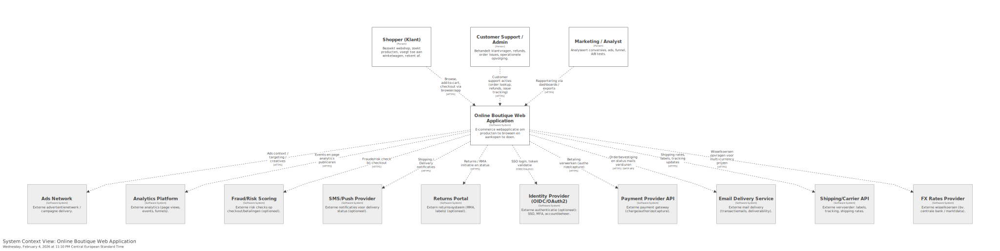
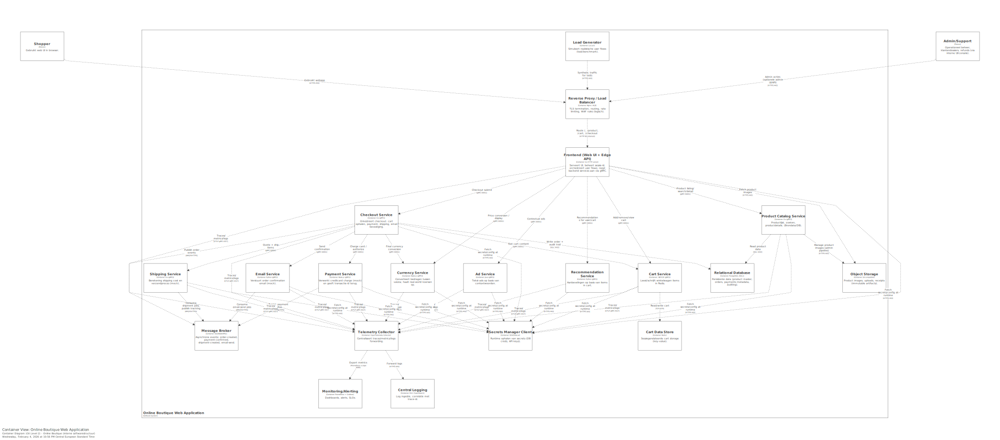
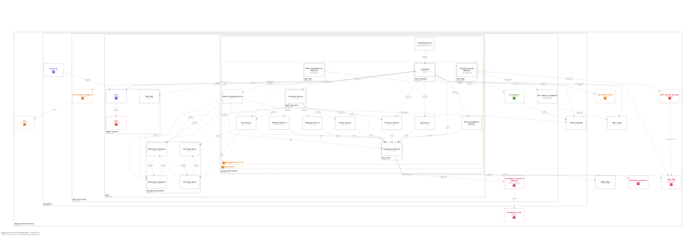

# Voorbeelddiagrammen

[Google Online Boutique microservice demo application](https://github.com/GoogleCloudPlatform/microservices-demo)

## C4 - L1 System Context Diagram

---

## C4 - L2 Container Diagram

---

## Deployment diagram

### Firewall Rules

#### SG-ALB (Application Load Balancer)

Doel: publiek verkeer ontvangen en alleen doorsturen naar frontend EC2.

#### Inbound Rules

| Source    | Protocol | Port | Description                          |
| --------- | -------- | ---- | ------------------------------------ |
| 0.0.0.0/0 | TCP      | 443  | HTTPS user traffic (production)      |
| 0.0.0.0/0 | TCP      | 80   | HTTP redirect naar HTTPS (optioneel) |

#### Outbound Rules

| Destination | Protocol | Port | Description                             |
| ----------- | -------- | ---- | --------------------------------------- |
| SG-APP      | TCP      | 80   | Forward traffic naar frontend instances |

---

### SG-APP (Frontend + Backend EC2 Instances)

Doel: applicatielaag, microservices, interne service calls.

#### Inbound Rules

| Source     | Protocol | Port  | Description                         |
| ---------- | -------- | ----- | ----------------------------------- |
| SG-ALB     | TCP      | 80    | ALB -> Frontend HTTP traffic        |
| SG-APP     | TCP      | 50051 | gRPC microservice east-west traffic |
| SG-BASTION | TCP      | 22    | SSH beheer (optioneel)              |

#### Outbound Rules

| Destination         | Protocol | Port | Description                           |
| ------------------- | -------- | ---- | ------------------------------------- |
| 0.0.0.0/0 (via NAT) | TCP      | 443  | External APIs, updates, SaaS services |
| SG-RDS              | TCP      | 5432 | PostgreSQL database                   |
| SG-REDIS            | TCP      | 6379 | Redis cache                           |
| AWS Secrets Manager | TCP      | 443  | Secrets ophalen                       |
| S3 Gateway Endpoint | TCP      | 443  | Object storage access                 |

---

### SG-RDS (Database Security Group)

Doel: database volledig isoleren.

#### Inbound Rules

| Source | Protocol | Port | Description                |
| ------ | -------- | ---- | -------------------------- |
| SG-APP | TCP      | 5432 | Backend application access |

#### Outbound Rules

| Destination | Protocol | Port | Description                  |
| ----------- | -------- | ---- | ---------------------------- |
| None        | -        | -    | Default deny (best practice) |

---

### SG-REDIS (Cache Layer)

Doel: alleen backend toegang.

#### Inbound Rules

| Source | Protocol | Port | Description          |
| ------ | -------- | ---- | -------------------- |
| SG-APP | TCP      | 6379 | Backend cache access |

#### Outbound Rules

| Destination | Protocol | Port | Description  |
| ----------- | -------- | ---- | ------------ |
| None        | -        | -    | Default deny |

---

### SG-BASTION (Admin Access)

Doel: veilige beheer-entrypoint.

#### Inbound Rules

| Source                | Protocol | Port | Description |
| --------------------- | -------- | ---- | ----------- |
| Admin Public IP Range | TCP      | 22   | SSH access  |

#### Outbound Rules

| Destination | Protocol | Port | Description        |
| ----------- | -------- | ---- | ------------------ |
| SG-APP      | TCP      | 22   | SSH to private EC2 |

---
