# Voorbeelddiagrammen

## C4 - L1 System Context Diagram

```mermaid
C4Context
title System Context Diagram (C4 Level 1) - "Online Boutique" webapplicatie (scope en externe omgeving)

Person(shopper, "Shopper (Klant)", "Bezoekt webshop, zoekt producten, voegt toe aan winkelwagen, rekent af.")
Person(admin, "Customer Support / Admin", "Behandelt klantvragen, refunds, order issues, operationele opvolging.")
Person(marketing, "Marketing / Analyst", "Analyseert conversies, ads, funnel, A/B tests.")

System(boutique, "Online Boutique Web Application", "E-commerce webapplicatie om producten te browsen en aankopen te doen.")

System_Ext(idp, "Identity Provider (OIDC/OAuth2)", "Externe authenticatie (optioneel): SSO, MFA, accountbeheer.")
System_Ext(payment_provider, "Payment Provider API", "Externe payment gateway (charge/authorize/capture).")
System_Ext(email_provider, "Email Delivery Service", "Externe mail delivery (transactiemails, deliverability).")
System_Ext(shipping_carrier, "Shipping/Carrier API", "Externe vervoerder: labels, tracking, shipping rates.")
System_Ext(fx_rates, "FX Rates Provider", "Externe wisselkoersen (bv. centrale bank / marktdata).")
System_Ext(ads_network, "Ads Network", "Externe advertentienetwerk / campagne delivery.")
System_Ext(analytics, "Analytics Platform", "Externe analytics (page views, events, funnels).")
System_Ext(fraud, "Fraud/Risk Scoring", "Externe risk checks op checkout/betalingen (optioneel).")
System_Ext(sms, "SMS/Push Provider", "Externe notificaties voor delivery status (optioneel).")
System_Ext(returns_portal, "Returns Portal", "Extern returns-systeem (RMA, labels) (optioneel).")

Rel(shopper, boutique, "Browse, add-to-cart, checkout via browser/app", "HTTPS")
Rel(admin, boutique, "Customer support acties (order lookup, refunds, issue tracking)", "HTTPS")
Rel(marketing, boutique, "Rapportering via dashboards / exports", "HTTPS")

Rel(boutique, idp, "SSO login, token validatie", "OIDC/OAuth2")
Rel(boutique, payment_provider, "Betaling verwerken (authorize/capture)", "HTTPS")
Rel(boutique, email_provider, "Orderbevestiging en status mails versturen", "HTTPS/SMTP API")
Rel(boutique, shipping_carrier, "Shipping rates, labels, tracking updates", "HTTPS")
Rel(boutique, fx_rates, "Wisselkoersen opvragen voor multi-currency prijzen", "HTTPS")
Rel(boutique, ads_network, "Ads context / targeting / creatives", "HTTPS")
Rel(boutique, analytics, "Events en page analytics publiceren", "HTTPS")
Rel(boutique, fraud, "Fraude/risk check bij checkout", "HTTPS")
Rel(boutique, sms, "Shipping/Delivery notificaties", "HTTPS")
Rel(boutique, returns_portal, "Returns/RMA initiatie en status", "HTTPS")
```



## C4 - L2 Container Diagram

```mermaid
C4Container
title Container Diagram (C4 Level 2) - Online Boutique (interne softwarestructuur)

Person(shopper, "Shopper", "Gebruikt web UI in browser.")
Person(admin, "Admin/Support", "Operationeel beheer, klantendossiers, refunds (via interne UI/console).")

System_Boundary(s1, "Online Boutique Web Application") {

  Container(lb, "Reverse Proxy / Load Balancer", "Nginx / ALB", "TLS termination, routing, rate limiting, WAF rules (logisch).")

  Container(frontend, "Frontend (Web UI + Edge API)", "Go HTTP server", "Serveert UI, beheert sessie-id, orchestreert user flows; roept backend services aan via gRPC.")  %% repo: frontend

  Container(checkout, "Checkout Service", "Go (gRPC)", "Orkestreert checkout: cart ophalen, payment, shipping, email bevestiging.") %% repo: checkoutservice
  Container(cart, "Cart Service", ".NET/C# (gRPC)", "Leest/schrijft winkelwagen items in Redis.") %% repo: cartservice
  Container(product, "Product Catalog Service", "Go (gRPC)", "Productlijst, zoeken, productdetails. (Brondata/DB).") %% repo: productcatalogservice
  Container(currency, "Currency Service", "Node.js (gRPC)", "Converteert bedragen tussen valuta; haalt real-world koersen op.") %% repo: currencyservice
  Container(payment, "Payment Service", "Node.js (gRPC)", "Verwerkt creditcard charge (mock) en geeft transactie-id terug.") %% repo: paymentservice
  Container(shipping, "Shipping Service", "Go (gRPC)", "Berekening shipping cost en verzendproces (mock).") %% repo: shippingservice
  Container(email, "Email Service", "Python (gRPC)", "Verstuurt order confirmation email (mock).") %% repo: emailservice
  Container(reco, "Recommendation Service", "Python (gRPC)", "Aanbevelingen op basis van items in cart.") %% repo: recommendationservice
  Container(ads, "Ad Service", "Java (gRPC)", "Tekst-ads op basis van contextwoorden.") %% repo: adservice

  Container(redis, "Cart Data Store", "Redis", "Sessiegerelateerde cart storage (key-value).")

  ContainerDb(rds_app, "Relational Database", "PostgreSQL (SQL)", "Persistente data (product master, orders, payments metadata, auditing).")

  Container(obj, "Object Storage", "S3-compatible", "Product images, uploads, receipts (immutable artifacts).")

  Container(queue, "Message Broker", "SQS/RabbitMQ", "Asynchrone events: order-created, payment-confirmed, shipment-created, email-send.")

  Container(otel, "Telemetry Collector", "OpenTelemetry Collector", "Centraliseert traces/metrics/logs forwarding.")
  Container(mon, "Monitoring/Alerting", "Prometheus + Grafana", "Dashboards, alerts, SLOs.")
  Container(logs, "Central Logging", "ELK / OpenSearch", "Log ingestie, correlatie met trace-id.")
  Container(sec, "Secrets Manager Client", "SDK/Sidecar", "Runtime ophalen van secrets (DB creds, API keys).")

  Container(loadgen, "Load Generator", "Locust", "Simuleert realistische user flows (test/benchmark).") %% repo: loadgenerator
}

Rel(shopper, lb, "Gebruikt webapp", "HTTPS 443")
Rel(admin, lb, "Admin acties (optionele admin UI/API)", "HTTPS 443")

Rel(lb, frontend, "Route /, /product, /cart, /checkout", "HTTP 80 -> internal")
Rel(frontend, product, "Product listing/search/detail", "gRPC 50051")
Rel(frontend, cart, "Add/remove/view cart", "gRPC 50051")
Rel(frontend, currency, "Price conversion / display", "gRPC 50051")
Rel(frontend, reco, "Recommendations for user/cart", "gRPC 50051")
Rel(frontend, ads, "Contextual ads", "gRPC 50051")
Rel(frontend, checkout, "Checkout submit", "gRPC 50051")

Rel(checkout, cart, "Get cart content", "gRPC 50051")
Rel(checkout, payment, "Charge card / authorize", "gRPC 50051")
Rel(checkout, shipping, "Quote + ship items", "gRPC 50051")
Rel(checkout, email, "Send confirmation", "gRPC 50051")
Rel(checkout, currency, "Final currency conversion", "gRPC 50051")

Rel(cart, redis, "Read/write cart", "TCP 6379")

Rel(product, rds_app, "Read product data", "SQL 5432")
Rel(checkout, rds_app, "Write order + audit trail", "SQL 5432")
Rel(frontend, obj, "Fetch product images", "HTTPS 443")
Rel(product, obj, "Manage product images (admin pipeline)", "HTTPS 443")

Rel(checkout, queue, "Publish order events", "AMQP/HTTPS")
Rel(email, queue, "Consume email-send jobs", "AMQP/HTTPS")
Rel(shipping, queue, "Consume shipment jobs, publish tracking", "AMQP/HTTPS")
Rel(payment, queue, "Publish payment status", "AMQP/HTTPS")

Rel(frontend, otel, "Traces/metrics/logs", "OTLP gRPC 4317")
Rel(checkout, otel, "Traces/metrics/logs", "OTLP gRPC 4317")
Rel(cart, otel, "Traces/metrics/logs", "OTLP gRPC 4317")
Rel(product, otel, "Traces/metrics/logs", "OTLP gRPC 4317")
Rel(currency, otel, "Traces/metrics/logs", "OTLP gRPC 4317")
Rel(payment, otel, "Traces/metrics/logs", "OTLP gRPC 4317")
Rel(shipping, otel, "Traces/metrics/logs", "OTLP gRPC 4317")
Rel(email, otel, "Traces/metrics/logs", "OTLP gRPC 4317")
Rel(reco, otel, "Traces/metrics/logs", "OTLP gRPC 4317")
Rel(ads, otel, "Traces/metrics/logs", "OTLP gRPC 4317")

Rel(otel, mon, "Export metrics", "Prometheus scrape 9090")
Rel(otel, logs, "Forward logs", "HTTPS 443")

Rel(loadgen, lb, "Synthetic traffic for tests", "HTTPS 443")

Rel(frontend, sec, "Fetch secrets/config at runtime", "HTTPS 443")
Rel(checkout, sec, "Fetch secrets/config at runtime", "HTTPS 443")
Rel(product, sec, "Fetch secrets/config at runtime", "HTTPS 443")
Rel(cart, sec, "Fetch secrets/config at runtime", "HTTPS 443")
Rel(payment, sec, "Fetch secrets/config at runtime", "HTTPS 443")
Rel(email, sec, "Fetch secrets/config at runtime", "HTTPS 443")
Rel(shipping, sec, "Fetch secrets/config at runtime", "HTTPS 443")
Rel(currency, sec, "Fetch secrets/config at runtime", "HTTPS 443")
Rel(reco, sec, "Fetch secrets/config at runtime", "HTTPS 443")
Rel(ads, sec, "Fetch secrets/config at runtime", "HTTPS 443")
```

---

## Deployment/Infrastructure diagram



```mermaid
flowchart TB

%% =========================
%% EDGE LAYER
%% =========================

users[End Users\nBrowsers/Mobile]
admins[Ops/Admins\nVPN/Bastion Access]
internet((Internet))

dns_public["Route53 Public DNS\nonline-boutique.com"]
waf["AWS WAF\nL7 Filtering"]

%% =========================
%% REGION + VPC
%% =========================

subgraph region["AWS Region eu-west-1"]
subgraph vpc["VPC 10.0.0.0/16"]

igw[Internet Gateway]

%% ROUTING
rtb_public["Public RT\n0.0.0.0/0 -> IGW"]
rtb_priv_a["Private RT AZ-A\n0.0.0.0/0 -> NAT-A"]
rtb_priv_b["Private RT AZ-B\n0.0.0.0/0 -> NAT-B"]

%% SECURITY GROUPS
sg_alb["SG-ALB\nIN:443/80 ANY\nOUT:80 SG-APP"]
sg_app["SG-APP\nIN:80 from ALB\nIN:50051 SG-APP\nOUT:443 NAT\nOUT:5432 RDS\nOUT:6379 REDIS"]
sg_rds["SG-RDS\nIN:5432 SG-APP"]
sg_redis["SG-REDIS\nIN:6379 SG-APP"]
sg_bastion["SG-BASTION\nIN:22 Admin IP"]

%% =========================
%% AZ A
%% =========================

subgraph az_a["Availability Zone A"]

subgraph pub_a["Public Subnet A 10.0.1.0/24"]
alb["Application Load Balancer\nHTTPS Listener 443"]
nat_a["NAT Gateway A"]
bastion["Bastion Host\nEC2 t3.micro"]
end

subgraph app_a["Private App Subnet A 10.0.11.0/24"]
fe_a["EC2 Frontend A\nt3.medium"]
be_a["EC2 Backend A\nm5.large"]
otel_a["OTel Agent A"]
end

subgraph data_a["Private Data Subnet A 10.0.21.0/24"]
rds_primary["RDS PostgreSQL Primary\ndb.m5.large"]
redis_primary["Redis Primary\ncache.t3.medium"]
end

end

%% =========================
%% AZ B
%% =========================

subgraph az_b["Availability Zone B"]

subgraph pub_b["Public Subnet B 10.0.2.0/24"]
nat_b["NAT Gateway B"]
end

subgraph app_b["Private App Subnet B 10.0.12.0/24"]
fe_b["EC2 Frontend B\nt3.medium"]
be_b["EC2 Backend B\nm5.large"]
otel_b["OTel Agent B"]
end

subgraph data_b["Private Data Subnet B 10.0.22.0/24"]
rds_standby["RDS Standby\nMulti-AZ"]
redis_replica["Redis Replica"]
end

end

%% =========================
%% SHARED SERVICES
%% =========================

s3["S3 Object Storage\nImages / Uploads"]
secrets["Secrets Manager"]
cloudwatch["CloudWatch Logs"]
prometheus["Prometheus"]
grafana["Grafana Dashboard"]

end
end

%% =========================
%% EDGE FLOW
%% =========================

users -->|DNS Query| dns_public
dns_public -->|A Record| alb

users -->|HTTPS 443| internet
internet --> waf
waf --> alb

%% =========================
%% SECURITY GROUP BINDINGS
%% =========================

sg_alb -.-> alb
sg_app -.-> fe_a
sg_app -.-> fe_b
sg_app -.-> be_a
sg_app -.-> be_b
sg_rds -.-> rds_primary
sg_rds -.-> rds_standby
sg_redis -.-> redis_primary
sg_redis -.-> redis_replica
sg_bastion -.-> bastion

%% =========================
%% ROUTING
%% =========================

igw --- vpc
rtb_public --> igw
rtb_priv_a --> nat_a
rtb_priv_b --> nat_b

rtb_public -.-> pub_a
rtb_public -.-> pub_b
rtb_priv_a -.-> app_a
rtb_priv_a -.-> data_a
rtb_priv_b -.-> app_b
rtb_priv_b -.-> data_b

%% =========================
%% LOAD BALANCING
%% =========================

alb -->|HTTP 80 Forward| fe_a
alb -->|HTTP 80 Forward| fe_b

alb -->|Health Checks| fe_a
alb -->|Health Checks| fe_b

%% =========================
%% APPLICATION FLOWS
%% =========================

%% Frontend to Backend
fe_a -->|gRPC 50051| be_a
fe_b -->|gRPC 50051| be_b
be_a <-->|Cross-AZ gRPC| be_b

%% Backend to DB
be_a -->|SQL 5432| rds_primary
be_b -->|SQL 5432| rds_primary

%% Redis
be_a -->|TCP 6379| redis_primary
be_b -->|TCP 6379| redis_replica

%% =========================
%% HA REPLICATION
%% =========================

rds_primary -.->|Sync Replication| rds_standby
redis_primary -.->|Async Replication| redis_replica

%% =========================
%% OUTBOUND TRAFFIC
%% =========================

be_a -->|HTTPS 443 Updates/APIs| nat_a
be_b -->|HTTPS 443 Updates/APIs| nat_b

nat_a --> igw
nat_b --> igw

%% =========================
%% STORAGE
%% =========================

fe_a -->|HTTPS 443| s3
fe_b -->|HTTPS 443| s3
be_a -->|HTTPS 443| s3
be_b -->|HTTPS 443| s3

%% =========================
%% SECRETS
%% =========================

fe_a -->|TLS| secrets
fe_b -->|TLS| secrets
be_a -->|TLS| secrets
be_b -->|TLS| secrets

%% =========================
%% OBSERVABILITY TRAFFIC
%% =========================

otel_a -->|OTLP Metrics| prometheus
otel_b -->|OTLP Metrics| prometheus

otel_a -->|Logs| cloudwatch
otel_b -->|Logs| cloudwatch

prometheus --> grafana

%% =========================
%% ADMIN ACCESS
%% =========================

admins -->|SSH 22| bastion
bastion -->|SSH 22| fe_a
bastion -->|SSH 22| fe_b
bastion -->|SSH 22| be_a
bastion -->|SSH 22| be_b
```

### Firewall Rules

#### SG-ALB (Application Load Balancer)

Doel: publiek verkeer ontvangen en alleen doorsturen naar frontend EC2.

#### Inbound Rules

| Source    | Protocol | Port | Description                          |
| --------- | -------- | ---- | ------------------------------------ |
| 0.0.0.0/0 | TCP      | 443  | HTTPS user traffic (production)      |
| 0.0.0.0/0 | TCP      | 80   | HTTP redirect naar HTTPS (optioneel) |

#### Outbound Rules

| Destination | Protocol | Port | Description                             |
| ----------- | -------- | ---- | --------------------------------------- |
| SG-APP      | TCP      | 80   | Forward traffic naar frontend instances |

---

### SG-APP (Frontend + Backend EC2 Instances)

Doel: applicatielaag, microservices, interne service calls.

#### Inbound Rules

| Source     | Protocol | Port  | Description                         |
| ---------- | -------- | ----- | ----------------------------------- |
| SG-ALB     | TCP      | 80    | ALB -> Frontend HTTP traffic        |
| SG-APP     | TCP      | 50051 | gRPC microservice east-west traffic |
| SG-BASTION | TCP      | 22    | SSH beheer (optioneel)              |

#### Outbound Rules

| Destination         | Protocol | Port | Description                           |
| ------------------- | -------- | ---- | ------------------------------------- |
| 0.0.0.0/0 (via NAT) | TCP      | 443  | External APIs, updates, SaaS services |
| SG-RDS              | TCP      | 5432 | PostgreSQL database                   |
| SG-REDIS            | TCP      | 6379 | Redis cache                           |
| AWS Secrets Manager | TCP      | 443  | Secrets ophalen                       |
| S3 Gateway Endpoint | TCP      | 443  | Object storage access                 |

---

### SG-RDS (Database Security Group)

Doel: database volledig isoleren.

#### Inbound Rules

| Source | Protocol | Port | Description                |
| ------ | -------- | ---- | -------------------------- |
| SG-APP | TCP      | 5432 | Backend application access |

#### Outbound Rules

| Destination | Protocol | Port | Description                  |
| ----------- | -------- | ---- | ---------------------------- |
| None        | -        | -    | Default deny (best practice) |

---

### SG-REDIS (Cache Layer)

Doel: alleen backend toegang.

#### Inbound Rules

| Source | Protocol | Port | Description          |
| ------ | -------- | ---- | -------------------- |
| SG-APP | TCP      | 6379 | Backend cache access |

#### Outbound Rules

| Destination | Protocol | Port | Description  |
| ----------- | -------- | ---- | ------------ |
| None        | -        | -    | Default deny |

---

### SG-BASTION (Admin Access)

Doel: veilige beheer-entrypoint.

#### Inbound Rules

| Source                | Protocol | Port | Description |
| --------------------- | -------- | ---- | ----------- |
| Admin Public IP Range | TCP      | 22   | SSH access  |

#### Outbound Rules

| Destination | Protocol | Port | Description        |
| ----------- | -------- | ---- | ------------------ |
| SG-APP      | TCP      | 22   | SSH to private EC2 |

---
