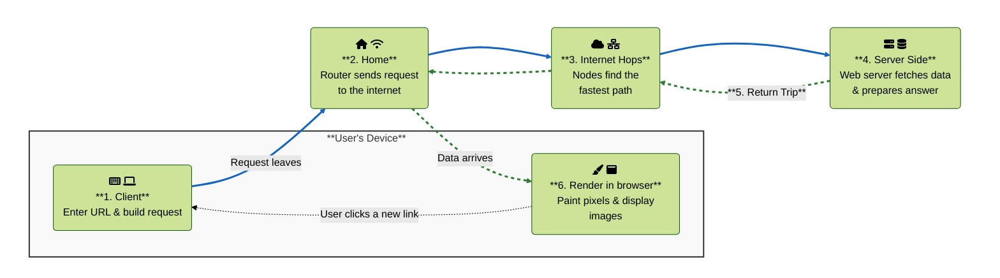
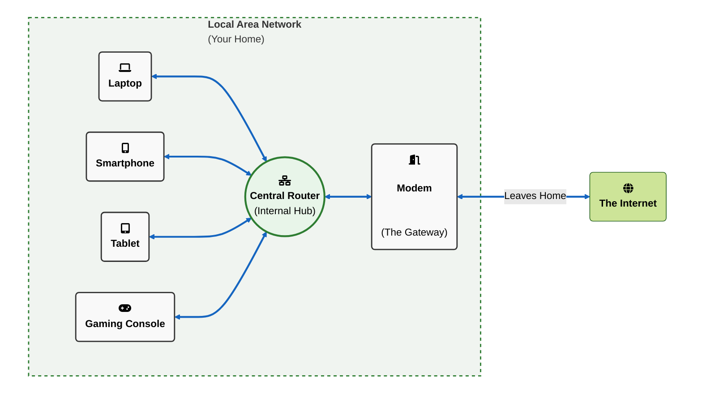
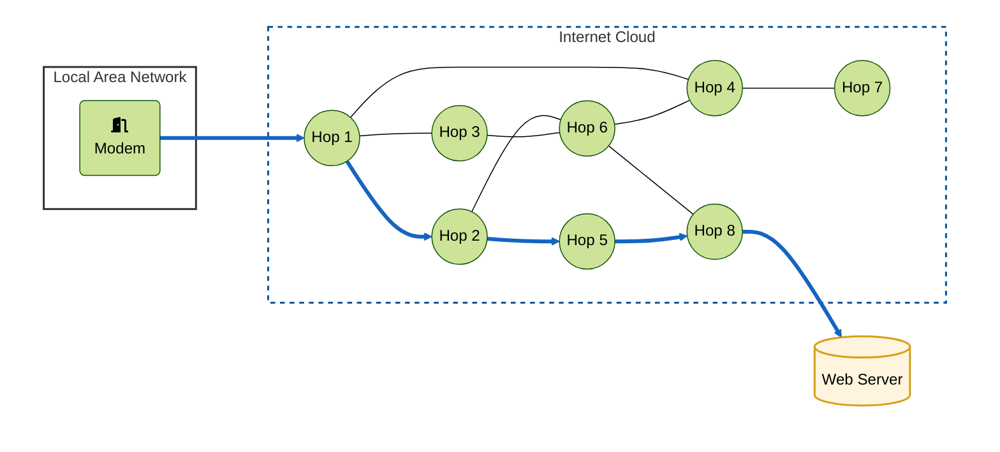
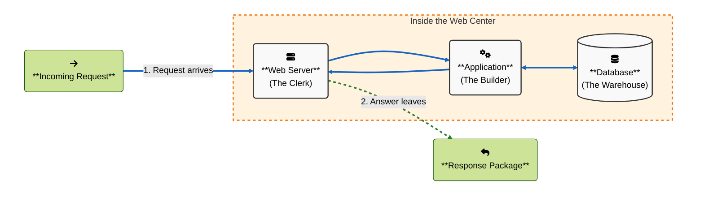
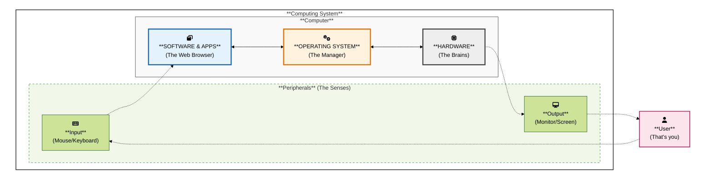

# Global IT Overview: From Click to Content

This chapter starts with the simplest story: you type a website into your browser, and something appears on your screen. At first, it feels like magic. We will unpack the black boxes one by one so you can see the hardware, networks, and software working together. In later modules we will zoom in; here we stay high-level and friendly.

- [The Lightning Tour (high-level map)](#the-lightning-tour-high-level-map)
- [Zooming In: Your Home Network](#zooming-in-your-home-network)
  - [Introducing the LAN](#introducing-the-lan)
  - [The Conductor and the Gatekeeper](#the-conductor-and-the-gatekeeper)
  - [Choosing Your Lane: Air vs. Cable](#choosing-your-lane-air-vs-cable)
- [The Internet Road Trip](#the-internet-road-trip)
  - [The Digital Relay Race](#the-digital-relay-race)
  - [The Smart Map-Readers](#the-smart-map-readers)
  - [Visualizing the Journey](#visualizing-the-journey)
- [The Destination - The Server Side](#the-destination---the-server-side)
  - [The Team Behind the Scenes](#the-team-behind-the-scenes)
  - [Assembling the Package](#assembling-the-package)
  - [Visualizing the Server Side](#visualizing-the-server-side)
- [The Final Stretch - Return and Rendering](#the-final-stretch---return-and-rendering)
  - [The Browser as an Artist](#the-browser-as-an-artist)
  - [The Loop is Complete](#the-loop-is-complete)
- [The Foundation - The Computer](#the-foundation---the-computer)
  - [The Three-Layer Cake](#the-three-layer-cake)
  - [Peripherals: The Senses](#peripherals-the-senses)
  - [The Missing Link: Interfaces](#the-missing-link-interfaces)
- [About the Course](#about-the-course)
- [TODO](#todo)

---

## The Lightning Tour (high-level map)

Let us start with a very basic operation you performed hundreds of times before: using your browser to visit a website.
You open your laptop and type [**boardgamegeek.com**](https://www.boardgamegeek.com) in the address bar of your web browser. Your request leaves your room, your house, crosses the planet and returns with board game lists and images. All this happens in a timespan of mere milliseconds. It's easy to ignore the complex technical flow that is executed every time we perform a similar action, but being an aspirant IT professional, you are extremely curious about this wondrous world. In this course, you will dive into this chain reaction and uncover every component that plays a role in it. During your further career at PXL-Digital, every component will be addressed in more detail.

Below is the high-level mental map we'll use for this part.

<link rel="stylesheet" href="https://cdnjs.cloudflare.com/ajax/libs/font-awesome/6.0.0/css/all.min.css">

How to read this diagram (using boardgamegeek.com as URL):

- **Client:** You enter the URL in your browser and press Enter; the browser builds an HTTP request for boardgamegeek.com.
- **Home:** Your router wraps the request and fires it from your home network into the internet.
- **Internet hops:** Multiple nodes are visited to find the fastest way to retrieve the requested data. This might be a cached version of the website, to reduce the time spent, or just the shortest path to contact the webserver that hosts the data you need.
- **Server side:** The targeted web server receives the request, asks a database for board game data, assembles the data in a response package and sends it back in your direction.
- **Return trip:** The response package from the web server retraces the path to your browser.
- **Render in browser:** Your browser receives the answer of the web server, parses the data in it, possibly fetches extra data in more requests (e.g. images), runs code or scripts and ultimately paints pixels on your screen. Some assets may be cached for faster next loads.

Takeaway: every click is a round trip through multiple cooperating layers.

Important note: this process is often repeated, possibly every time you click a specific board game or select another top 10 ranking on the page. Don't forget this, the more you think about it, the more you should be impressed about all the technology that makes the world go round these days.

If boardgamegeek.com feels slow, the delay could be caused by one of these components. The speed of this whole chain of actions will always be determined by the slowest factor in the chain. (e.g. Wi-Fi, your ISP, another node at the internet, the CDN, the web server, the database, ...)

---

## Zooming In: Your Home Network

Now that we have the "big picture", let's zoom in on the first component, where the whole process starts and ends: your home network. Before your request can cross the planet, it first has to navigate the small but crucial network inside your own four walls.

### Introducing the LAN

In the world of IT, this kind of home network is also known as a LAN, or **Local Area Network**. The "Local" part is key: it is a private network that connects devices within a limited area, like your home, your classroom, or an office building. Everything inside this "local bubble" can communicate with each other, without ever needing to touch the global internet. When your laptop sends a document to your wireless printer or you instruct your voice assistant to start dimming the smart lights in the kitchen, that's your LAN at work!

Think of your LAN as a private transit system. Your laptop isn't the only "passenger" here; your smartphone, a tablet, your gaming console, a smart TV, or even a smart fridge are all sharing the same connection. To keep this traffic organized, all these devices rely on a single central hub to get their data to the outside world.

### The Conductor and the Gatekeeper

Inside this LAN, two specific roles are played to ensure that when you request data from the internet (e.g. details about a board game), the data doesn't accidentally end up on your roommate's smartphone or your smart fridge.

**The Central Router (The Conductor)**: This is the heart of your LAN. It manages the internal traffic. It knows exactly which device is which. When the data for boardgamegeek.com returns, the router ensures it goes to your laptop and not your gaming console.

**The Modem (The Gateway)**: The modem sits at the very edge of your LAN. Its job is to translate your home's digital signals into a format that can travel through the provider's cables in the street. It is the physical bridge between your private LAN and the public Internet.

### Choosing Your Lane: Air vs. Cable

There are two main ways that your device can use to talk to this hub:

Wireless (Wi-Fi): The data travels through the air via radio waves. It's **convenient** but can be slowed down by walls, distance, or other electronic devices.

Wired (Ethernet): The data travels through a physical cable. This is usually the fastest and most stable "lane" in your home.

Once your request reaches the router, it is packaged up and sent through a physical line (fiber, copper, or coax) that leads out of your house and into the street, onto the World Wide Web.

---

## The Internet Road Trip

Once your request passes through the modem and leaves your house, it enters the most mysterious part of the journey. In your home, you knew exactly where the router and the cables were. Now, your request for data is "out in the wild."

### The Digital Relay Race

The internet isn't one single "thing" or one direct cable from your house to a server in America. Instead, it is a massive, global web of interconnected networks.

Think of this part of the journey as a relay race. Your request is the baton, and it is passed from one station to the next. These stations are called Internet Hops. Your data might jump through five, ten, or even twenty different stations across the country or under the ocean before it reaches its destination. Remember, all this - including the way back - happens in the blink of an eye, at nearly the speed of light. Fascinating, right?

### The Smart Map-Readers

At every "hop", there is a specialized machine that looks at the address on your request. It doesn't know the full path to the final destination, but it knows the best "next step".

- It checks for the fastest current route.
- It avoids "traffic jams" where too many other people are sending data.
- It might even find a Cached Version of the website. This is like a "snapshot" of the page stored at a station closer to your house, so the request doesn't have to travel all the way to the original server.

### Visualizing the Journey

The diagram below shows you how the request moves from your private LAN into the vast, shared space of the internet.

---

## The Destination - The Server Side

After surviving the global relay race of the internet hops, your request finally arrives at its destination: the Web Server. If the internet was the highway, this is the massive warehouse where the goods (e.g. the board game data) are stored and packaged just for you.

### The Team Behind the Scenes

When your request hits the server side, it isn't just one machine doing all the work. It is a highly coordinated team of components:

1. The Web Server (The Clerk): This is the front office. It receives your request, checks if it's valid, and decides what needs to be done to handle it. It acts as the face of the website.
2. The Application (The Builder): This is the logic of the site. It's like a chef following a recipe. In the case of BoardGameGeek, it knows how to assemble a list of top-ranked games, user comments, high-resolution images, ... depending on your specific request.
3. The Database (The Warehouse): This is where the actual raw data lives. Millions of board game titles, ratings, and descriptions are stored in organized digital shelves. The "Builder" asks the "Warehouse" to gather specific items to complete your request.

### Assembling the Package

Once the Builder has gathered everything from the Warehouse, it wraps it all up into a digital package. This package can contain all kinds of data, and you will learn a lot of those data formats and types in the near future. Some names might already sounds familiar to you: HTML, CSS, JS, JSON, ... The Clerk then hands this package back to the "Internet Hops" to begin the long (but extremely fast) return journey to your home.

### Visualizing the Server Side

This diagram shows how your request enters the server's world, triggers a search for data, and is transformed into the response you see on your screen.

---

## The Final Stretch - Return and Rendering

The "Response Package" created by the web server now begins its return journey. This is the mirror image of the trip out: it jumps back through the Internet Hops, enters your Modem, and is directed by your Router straight to your device.

But when the data arrives at your laptop, it isn't a pretty website yet. It is just a collection of code, text, and instructions. This is where your browser takes over for the final, most visual step.

### The Browser as an Artist

Think of your web browser (Chrome, Firefox, Safari) as a master artist. When it receives the response, it performs a process called Rendering:

1. Reading the Blueprint: The browser reads the code (HTML and CSS) to understand where every button, image, and line of text should go.
2. Fetching Extras: Sometimes, the package says "Place an image of a board game here." If that image wasn't in the original package, the browser automatically fires off a tiny new request to go get it.
3. Painting Pixels: Finally, the browser "paints" the pixels on your screen. It translates digital instructions into the colors and shapes you see.

### The Loop is Complete

In the time it took you to blink, your request traveled the world, a database was searched, a package was built, and your browser painted a masterpiece.

But remember: this isn't a one-time event. The moment you click a "Next Page" button or a "Sort by Rank" filter, the entire chain reaction - from your LAN to the Internet Hops to the Server Side - starts all over again.

That completes our high-level journey! We've covered the LAN, the Hops, and the Server, but there's one important component that plays a crucial role in every single step that we described... **computers**!

---

## The Foundation - The Computer

Whether it is the smartphone in your hand, the router on your shelf, or the massive server in a data center, the entire internet is just a conversation between different types of computers. To understand the journey of data, we have to understand the three "layers" that make these machines work.

### The Three-Layer Cake

Think of a computer like a building. You need a solid foundation, a functional interior, and people inside doing the work.

- **Hardware** (The Foundation): This is the physical stuff you can touch. It’s the circuit boards, the processor (the brain), the memory, and the cables. Without hardware, there is no place for the data to go.
- **Operating System** (The Manager): This is the "boss" of the hardware. Whether it's Windows, macOS, Android, or Linux, the Operating System (OS) decides how much power the screen gets, how to store a file, and how to talk to the Wi-Fi chip. It translates your clicks into language the hardware understands.
- **Software & Apps** (The Workers): This is the top layer. Your web browser is a piece of software. Its only job is to request and display websites. It sits on top of the OS and uses the hardware to get the job done.

### Peripherals: The Senses

A computer by itself is just a box. To be useful to us, it needs peripherals - external devices that are linked to your computer. These are the "senses" of the computer:

- Input Devices: How you tell the computer what to do (keyboard, mouse, touchscreen, microphone).
- Output Devices: How the computer talks back to you (monitor, speakers, printer, headphones).

In our board game example, your mouse (input peripheral) started the journey with a click, and your monitor (output peripheral) finished the journey by showing you the game's ranking.

### The Missing Link: Interfaces

The way each of these peripherals is connected to your computer can vary. A monitor can be connected via the HDMI interface, wireless headphones often use Bluetooth, and we all know the USB interface that can be used to connect a wide range of devices.

In the IT world, the term "**interface**" might sound abstract, but it simply means a "meeting point". It is the shared boundary where two different things exchange information. This can be between any two components, like two pieces of hardware, two pieces of software or a human and a machine.
Just like a language is an interface for two people to trade ideas, an IT interface is the set of rules and physical connections that allow data to flow from one part of our journey to the next. Whether it's a plug you can see or an invisible wireless handshake, the interface is what defines how the components talk to each other.

---

## About the Course

This chapter gave you a broad, high-level overview of the world of IT. In the remaining modules of this course, we will be addressing several components of this overview in more detail. You can always refer to the diagrams in this module to place certain topics in the right context.

---

## TODO

- Fix graphs
  - for web server: response package block should be below request, left of web server component
  - for computer: I'd like to see the 3 main layers of a computer (hardware, OS, software) stacked vertically
- Fix font awesome icons in the graphs
  - No FA love in github env... other options: use images = takes effort, use emoji's = lame, hexcode icons = not pretty
  - Tried forcing it, but very likely to be stripped on github page.
