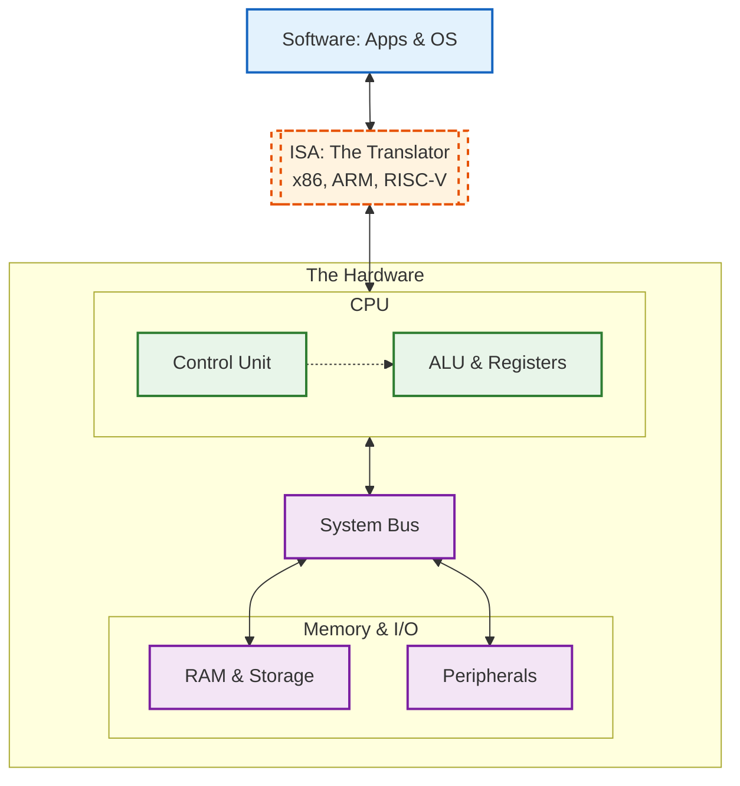

# Inside the computer: Hardware, Logic, Bits and the CPU

Hardware and software are two different worlds. One is made of metal and silicon; the other is made of logic and code.

How do they talk to each other? They need a translator. The diagram below shows the complete stack. We will focus on the hardware layer and the critical bridge that connects it to your software.



---

- [Hardware Fundamentals](#hardware-fundamentals)
  - [The Physical Anatomy](#the-physical-anatomy)
  - [Core Components](#core-components)
  - [Storage Hierarchy](#storage-hierarchy)
  - [Architectures and Form Factors](#architectures-and-form-factors)
- [Binary Representation and Arithmetic](#binary-representation-and-arithmetic)
- [CPU Architecture and ISA](#cpu-architecture-and-isa)
  - [The Von Neumann Architecture](#the-von-neumann-architecture)
  - [Internal Subsystems](#internal-subsystems)
    - [The Datapath](#the-datapath)
    - [The Control Unit (CU)](#the-control-unit-cu)
  - [The Instruction Cycle](#the-instruction-cycle)
  - [ISA: Instruction Set Architecture](#isa-instruction-set-architecture)
    - [Architecture Families: CISC vs. RISC](#architecture-families-cisc-vs-risc)
  - [Execution Example](#execution-example)

---

## Hardware Fundamentals

*The Context: What is the physical machine?*

Before we talk about binary code and logic gates, we must acknowledge that a computer is a physical machine made of metal, silicon, and fiberglass. It generates heat, consumes power, and operates within strict physical constraints.

### The Physical Anatomy

If you examine a desktop computer or a laptop mainboard, you will see a complex arrangement of electronic components.


- **The Motherboard (PCB):** This is the main Printed Circuit Board that provides the electrical and logical connections for the system. It houses the CPU socket, RAM slots, and expansion interfaces, acting as the central hub for all hardware communication.
- **The Chipset:** A set of electronic components (often a single Platform Controller Hub or PCH in modern systems) that acts as a traffic controller for peripherals. While older systems used the chipset to control memory, modern CPUs handle RAM directly. The chipset now focuses on managing connections for audio, networking, and storage devices.
- **PCIe (Peripheral Component Interconnect Express):** This is the high-speed standard used to connect fast internal hardware. Unlike older shared "buses," PCIe uses dedicated point-to-point pathways called **lanes** (x1, x4, x16) to connect the CPU to graphics cards and add-in cards.
- **M.2 Interface:** A compact, flat connector directly on the motherboard. It is the modern standard for installing high-speed NVMe SSDs and Wi-Fi modules without using bulky cables.
- **External Interfaces:** The physical ports for connectivity. **USB** connects general peripherals; **HDMI** transmits uncompressed digital video and audio to displays; and **Thunderbolt** extends internal PCIe speeds to external devices.

> **Did you know?**
> If you look closely at a motherboard, you might see copper traces that wiggle back and forth like a snake. This isn't for decoration - it is to manage the speed of light.
>
> Electricity travels at a finite speed. In high-performance systems like DDR5 RAM or PCIe, data signals must arrive at the processor at the exact same nanosecond. If one physical path is shorter than another, the data would arrive too early and cause errors. Engineers intentionally "squiggle" the shorter traces *(serpentine routing)* to add length, ensuring that every signal races to the finish line and crosses it at the exact same moment.

### Core Components

Every general-purpose computer consists of three primary subsystems:

1. **The CPU (Central Processing Unit):**
   - core component responsible for interpreting and executing instructions
   - performs arithmetic and logical operations
   - relies on external memory for data storage.
2. **RAM (Random Access Memory):**
   - The system's primary working memory.
   - **Volatile:** Data is lost when power is removed.
   - **High-Speed:** Provides the CPU with rapid access to data and instructions currently in use.
   - acts as a buffer between the extremely fast CPU cache and the slower secondary storage.

3. **I/O (Input/Output):**
   - The interfaces that allow the system to receive data and send results.
   - **Input:** Devices like keyboards and sensors that provide data to the system.
   - **Output:** Devices like displays and network transmitters that present processed data.
   - I/O controllers manage the communication protocols between these external devices and the system bus.

> **Historical Context:**
> The Apollo Guidance Computer (1966), which landed humans on the moon, had only about 4KB of RAM and 72KB of ROM. Today, a single icon on your smartphone screen uses more memory than that entire navigation system.

### Storage Hierarchy

Computers utilize a tiered storage architecture to balance speed, capacity, and cost. This is known as the **Storage Hierarchy**.

1. **CPU Registers:** Immediate access storage located directly inside the CPU core.
2. **L1/L2/L3 Cache:** SRAM (Static RAM) integrated into the CPU to store frequently accessed data.
3. **RAM:** DRAM (Dynamic RAM) used for active applications and system processes.
4. **Secondary Storage:** Non-volatile memory used for long-term data retention.

> **Perspective: The Speed Gap**
> To visualize the difference in speed: If fetching data from **CPU Registers** took *1 second*, fetching data from **RAM** would take about *4 minutes*, and fetching data from a **Hard Disk** would take roughly *6 months*. This massive gap is why Caches (L1/L2/L3) are critical for performance.

**Types of Secondary Storage:**

- **SSD (Solid State Drive):**
  - Uses NAND Flash memory to store data electronically.
  - significantly lower latency and higher throughput than HDDs, with no moving parts.
- **HDD (Hard Disk Drive):**
  - Uses magnetic storage on spinning magnetized-glass platters read by a motorized head.
  - High capacity and low cost per gigabyte, but high latency and mechanical vulnerability.
- **NVMe (Non-Volatile Memory Express):**
  - communication interface and driver
  - for PCIe-based SSDs
  - These into the **M.2** slot and connect directly to the system's PCIe lanes

### Architectures and Form Factors

While the underlying components remain consistent, hardware architecture varies based on the deployment environment.

- **Servers:** Optimized for **Reliability** and **Throughput**.
  - Designed for continuous operation.
  - Often utilize **ECC RAM** (Error Correcting Code) to detect and fix bit flips.
  - Prioritize thermal management and redundancy over noise reduction or size.
- **Desktops/Laptops:** Optimized for **Versatility** and **Interactive Performance**.
  - Balanced to handle a mix of bursty workloads (web browsing, compiling code, rendering, gaming).
- **Mobile:** Optimized for **Power Efficiency** and **Integration**.
  - Typically use **SoC** (System-on-Chip) architectures, integrating the CPU, GPU, RAM, and radio modems onto a single silicon die to reduce footprint and power consumption.
  - Predominantly use the **ARM** architecture (RISC) due to its superior performance-per-watt ratio compared to traditional x86 designs.

> **Reliability: Cosmic Rays**
> High-energy particles from space (cosmic rays) can occasionally hit a silicon chip and flip a single bit of data - changing a `0` to a `1`. While a single "bit flip" might just crash a game on a desktop, it could corrupt a global financial database in a server. This is why servers use **ECC RAM**, which includes extra bits of data to detect and automatically correct these "Single Event Upsets."

---

## Binary Representation and Arithmetic

*The Language: How do we represent information?*

**Key Concepts**

- **The Bit:** Why computers use base-2 (on/off).
- **Number Systems:**
  - Binary to Decimal conversion.
  - Hexadecimal: Why it is used as shorthand for binary.
- **Data Representation:**
  - **Unsigned Integers:** Counting.
  - **Signed Integers:** Two's complement (briefly, to explain negative numbers).
  - **Bitwise Operations:** AND, OR, XOR, NOT, Shift Left/Right.
  - **Masking:** How to isolate specific bits (crucial for flags/permissions).

[TO BE EXPANDED]

---

## CPU Architecture and ISA

This section details how individual logic components like Registers, ALU, and Control Logic, are organized into a functioning computational system.

### The Von Neumann Architecture

Modern general-purpose computers rely on the **Von Neumann** architecture.

Its defining characteristic is the **Stored-Program Concept**, which differentiates it from earlier fixed-function hardware.

- **Unified Memory:** Instructions (code) and Data (variables) reside in the **same addressable memory space (RAM)**.
- **Sequential Execution:** The processor fetches instructions one by one from memory, using a Program Counter to track the execution sequence.
- **The Von Neumann Bottleneck:** Since instructions and data share the same system bus, the CPU cannot fetch an instruction and read a data operand simultaneously. High-performance systems mitigate this with split caches (L1 Instruction Cache and L1 Data Cache).

### Internal Subsystems

The CPU consists of two primary subsystems: the **Datapath** and the **Control Unit**.

#### The Datapath

The Datapath is the collection of functional units that perform data processing operations.

- **Register File:**
  - A set of high-speed internal storage locations.
  - **General Purpose Registers (GPRs):** Store operands for the ALU (e.g., integers, pointers). In a Load-Store architecture, the ALU can only operate on data residing here, not directly in RAM.
  - **Special Purpose Registers:**
    - **Program Counter (PC):** Stores the memory address of the next instruction.
    - **Instruction Register (IR):** buffer that holds the current instruction binary for decoding.
    - **Stack Pointer (SP):** Points to the top of the current stack frame in memory.
- **ALU (Arithmetic Logic Unit):**
  - A combinational logic circuit that performs integer arithmetic (ADD, SUB) and bitwise logical operations (AND, OR, XOR).
- **Interconnects:** Internal buses that transport data between the registers and the ALU, electrical wiring basically.

#### The Control Unit (CU)

The Control Unit directs the operation of the processor. It is a Finite State Machine (FSM) that coordinates the Datapath.

- **Decoding:** The CU reads the opcode from the Instruction Register.
- **Signal Generation:** Based on the opcode, it asserts specific electrical control signals. These signals select ALU operations, enable/disable register write lines, and control multiplexers (muxes) to route data flow.

### The Instruction Cycle

The CPU executes a continuous loop known as the **Fetch-Decode-Execute** cycle.

1. **Fetch:** The CPU places the address from the **Program Counter (PC)** onto the address bus. System memory returns the instruction data, which is stored in the **Instruction Register (IR)**. The PC increments to the next address.
2. **Decode:** The Control Unit parses the binary data in the IR to identify the instruction type and the required operands (register indices or immediate values).
3. **Execute:** The Control Unit activates the necessary Datapath components. For an arithmetic operation, the ALU computes the result. For a memory operation, the address is calculated.
4. **Writeback:** The result of the execution is written to the destination register or, in the case of a STORE instruction, sent to the memory data bus.

### ISA: Instruction Set Architecture

The **ISA** serves as the abstract interface between the hardware and software. It is the specification that defines the processor's capabilities to the programmer and the compiler.

- **State Definition:** Defines the available registers, memory addressing modes, and data types (e.g., 32-bit integer, floating point).
- **Instruction Set:** The specific vocabulary of opcodes the CPU can execute.
- **Binary Encoding:** The exact bit patterns representing each instruction.

#### Architecture Families: CISC vs. RISC

Processor designs typically fall into one of two categories based on instruction set complexity.

| Feature | **CISC (Complex Instruction Set Computer)** | **RISC (Reduced Instruction Set Computer)** |
| --- | --- | --- |
| **Representative Arch** | **x86, x86-64** | **ARM, RISC-V** |
| **Instruction Complexity** | Instructions can perform complex multi-step operations (e.g., a single instruction to copy a string of text). | Instructions are simple primitives. Complex operations are built by the compiler using sequences of simple instructions. |
| **Instruction Length** | **Variable.** Instructions may range from 1 byte to 15+ bytes. This complicates the hardware decoding logic. | **Fixed.** Instructions are typically a uniform size (e.g., 32-bit). This simplifies decoding and pipelining. |
| **Memory Access** | **Register-Memory.** Arithmetic instructions can often access memory directly (e.g., Add value in RAM to Register). | **Load-Store.** Arithmetic can only occur between registers. Data must be explicitly loaded from RAM to a register first. |

### Execution Example

The following demonstrates a standard **Load-Store (RISC)** execution flow for the operation `x = x + 1`.

Because the ALU cannot access system RAM directly, the data must be moved into the Register File before processing.

```javascript
// Assumptions: Variable 'x' is located at Memory Address 0x100

LOAD  R1, [0x100]    ; Step 1: Memory Read.
                     ; The value at address 0x100 is copied into Register R1.

ADD   R1, R1, #1     ; Step 2: ALU Operation.
                     ; The ALU adds immediate value 1 to R1.
                     ; The result is placed back in R1.

STORE R1, [0x100]    ; Step 3: Memory Write.
                     ; The new value in R1 is written back to address 0x100.

```
