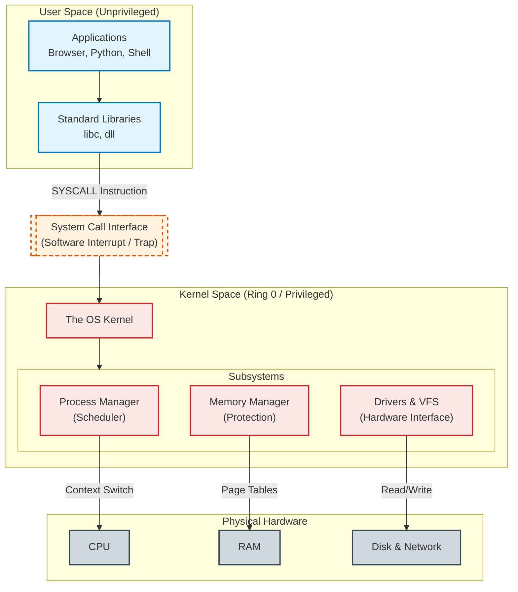

# Operating Systems, Processes and Virtualization

- [The Kernel: Responsibilities](#the-kernel-responsibilities)
  - [Process Management (The Scheduler)](#process-management-the-scheduler)
  - [Memory Protection](#memory-protection)
  - [Hardware Interfacing (Drivers)](#hardware-interfacing-drivers)
- [Protection Rings: User Space vs. Kernel Space](#protection-rings-user-space-vs-kernel-space)
  - [The System Call (The Bridge)](#the-system-call-the-bridge)
- [The Operating System vs. The Kernel](#the-operating-system-vs-the-kernel)
  - [Architecture Comparison: Windows vs. Linux](#architecture-comparison-windows-vs-linux)
- [Linux Basics: The User Perspective](#linux-basics-the-user-perspective)
  - [The Shell (Bash)](#the-shell-bash)
  - [The Linux File System Hierarchy](#the-linux-file-system-hierarchy)
  - [Essential Bash Commands](#essential-bash-commands)
- [Processes and Scheduling](#processes-and-scheduling)
  - [Anatomy of a Process](#anatomy-of-a-process)
  - [Process States and Scheduling](#process-states-and-scheduling)
  - [Observing Processes in Linux](#observing-processes-in-linux)
- [Memory and File Systems](#memory-and-file-systems)
  - [Virtual Memory](#virtual-memory)
  - [File Systems](#file-systems)
- [Virtualization and Containers](#virtualization-and-containers)
  - [Virtual Machines (Hypervisors)](#virtual-machines-hypervisors)
  - [WSL2 (Windows Subsystem for Linux 2)](#wsl2-windows-subsystem-for-linux-2)
  - [Containers (Docker)](#containers-docker)

## The Kernel: Responsibilities

At the heart of every computer sits a critical piece of software called the **Kernel**. It is the first program loaded after the computer boots and remains in memory until the system shuts down. While we often talk about "Operating Systems" like Windows or Linux, the Kernel is the engine that makes them work.

The Kernel has absolute control over the computer. Its primary role is to manage the limited hardware resources (CPU, RAM, Disks) and provide a safe environment for programs to run. Its duties can be broken down into three main pillars:

### Process Management (The Scheduler)

A computer has a limited number of CPU cores, but a user wants to run dozens of programs simultaneously (browser, music, code editor).

- Programs compete for CPU time.
  - If one program freezes or enters an infinite loop, it should not freeze the entire computer.

- **The Kernel's Role:**
  - The Kernel acts as a strict scheduler.
  - It slices CPU time into tiny milliseconds and rotates execution between running programs.
  - It decides which process runs next, pauses others, and completely stops ("kills") processes that misbehave.

### Memory Protection

Every program needs memory (RAM) to store its data.

- If Program A can read or write to the memory used by Program B, it leads to crashes (corrupted data) or security breaches (stealing passwords).
- **The Kernel's Role:**
  - The Kernel enforces strict memory (RAM) isolation.
  - It assigns a specific, private sandbox of memory to each process.
  - If a process tries to access memory outside its assigned boundary, the Kernel intervenes and crashes only that specific process, leaving the rest of the system unharmed.

### Hardware Interfacing (Drivers)

Software needs to talk to hardware, but hardware is complex and varies wildly (thousands of different keyboards, network cards, and hard drives exist).

- A programmer cannot write code to support every specific model of hard drive or Wi-Fi chip in existence.
- **The Kernel's Role:**
  - The Kernel uses **Device Drivers** to translate complex hardware signals into standard software commands.
  - It provides a clean "Abstraction Layer."
  - The application simply asks to "Save File," and the Kernel handles the specific electrical signals needed to write data to that specific SSD or Hard Disk.

---

## Protection Rings: User Space vs. Kernel Space

To perform the duties above effectively, the Kernel must have higher authority than normal programs. Modern CPUs enforce this via a hardware feature called **Protection Rings**.

The diagram maps this architecture, showing the strict isolation boundary between where your apps run and where the kernel runs.

- **Ring 0 (Kernel Space):**
  - Directly implemented in CPU silicon
  - This is the "Privileged" mode.
  - Code executing here has unrestricted access to all hardware instructions and every address in memory.
  - The Kernel lives here.
- **Ring 3 (User Space):**
  - This is the "Unprivileged" mode.
  - Code here is restricted.
  - It cannot touch hardware directly (no access to disk or network card) and cannot see memory belonging to other apps.
  - Web browsers, applications, video games, and Python scripts run here.

### The System Call (The Bridge)

> If a User Space application is restricted from touching hardware, how does it save a file or send a network packet? It must ask the Kernel to do it on its behalf via a **System Call**.

When you write `file.write("data")` in your code:

1. The application calls a standard library function.
2. The library places the request details into CPU registers.
3. The library executes a specific CPU instruction (e.g., `SYSCALL`).
4. **The Switch:** The CPU hardware instantly switches privileges from Ring 3 to Ring 0 and jumps to the Kernel's code.
5. The Kernel validates the request (permissions check), performs the hardware operation, and switches back to Ring 3.

---

## The Operating System vs. The Kernel

Now that we understand the core technology, we can look at the bigger picture.

**The Kernel (The Core)**

- This is the technical component we discussed above (`vmlinuz` on Linux, `ntoskrnl.exe` on Windows).
- It is the only program that talks directly to the hardware.

**The Operating System (The Package)**

- The "OS" is the entire product that makes the computer usable for a human.
- It wraps the Kernel with tools, utilities, and visual interfaces.

Examples:

- **Windows 11:** Includes the Desktop Manager (Explorer), Edge Browser, Windows Defender, Update Service, *and* the NT Kernel.
- **Ubuntu (Linux):** Includes the GNOME Desktop, Bash Shell, GNU Utilities (ls, cp, grep), *and* the Linux Kernel.

### Architecture Comparison: Windows vs. Linux

The internal design of these kernels differs significantly.

| Feature | **Linux Kernel (Monolithic)** | **Windows NT Kernel (Hybrid)** |
| --- | --- | --- |
| **Philosophy** | **Monolithic:** The Scheduler, Memory Manager, File System, and *Drivers* all run as a single, large memory block in Ring 0. | **Hybrid:** Uses a "Hardware Abstraction Layer" (HAL) to isolate the kernel from the specific motherboard. Drivers and subsystems are more compartmentalized. |
| **Drivers** | Drivers (Modules) are part of the kernel space. A buggy video driver can easily crash the whole system (Kernel Panic). | Drivers (`.sys`) are heavily managed. Windows allows restarting graphics drivers without rebooting the kernel in some cases, but they still run in Kernel space. |
| **Process Creation** | **`fork()`**: Creates a new process by cloning the existing one perfectly. This is extremely efficient. | **`CreateProcess()`**: Builds a new process from scratch. It is a heavier operation requiring more parameters. |
| **File Structure** | **Unified Hierarchy:** "Everything is a file." Hardware (`/dev/sda`), processes (`/proc`), and data all live under one Root (`/`). | **Drive Letters:** Physical partitions are assigned letters (`C:`, `D:`). Hardware is accessed via the Registry or Device Manager, not the file system. |

---

## Linux Basics: The User Perspective

While the Kernel manages resources in the background, the user interacts with the system via a Shell. In Linux, this is a text-based interface that allows direct manipulation of the system via commands.

### The Shell (Bash)

The shell is a command-line interpreter. It runs in User Space, takes commands you type, and sends them to the OS to execute. The most common shell is **Bash** (Bourne Again SHell).

When you open a terminal, you see a **Prompt**, typically structured like this:
`username@hostname:current_directory$`

- `~` (tilde) represents your **Home Directory** (`/home/username`).
- `$` indicates you are a normal user.
- `#` indicates you are the root user (administrator).

### The Linux File System Hierarchy

Unlike Windows, which uses drive letters (C:, D:), Linux uses a single hierarchical tree structure starting at **Root** (`/`).

- `/`: The root of the filesystem.
- `/home`: Contains user personal data (similar to `C:\Users`).
- `/etc`: Contains system configuration files.
- `/bin` & `/usr/bin`: Contains executable programs (commands like `ls`, `python`).
- `/var`: Contains variable data like logs and temporary files.

### Essential Bash Commands

Proficiency in Linux requires understanding how to navigate and manipulate this file system.

<!-- omit from toc -->
#### Navigation

> The correct name for the file system structure that can contain other files is "directory", not "folder", and certainly not "map".

- `pwd`: **P**rint **W**orking **D**irectory. Shows you where you currently are in the file system.
- `ls`: **L**i**s**t. Shows files in the current directory.
- `ls -l`: Detailed list (permissions, size, owner).
- `ls -a`: All files, including hidden files (files starting with `.`).
- `cd`: **C**hange **D**irectory.
- `cd Documents`: Move into the Documents directory.
- `cd ..`: Move up one level (parent directory).
- `cd ~` or just `cd`: Return to home directory.

<!-- omit from toc -->
#### File Manipulation

- `mkdir <name>`: **M**a**k**e **Dir**ectory. Creates a new directory.
- `touch <file>`: Creates an empty file or updates the timestamp of an existing one.
- `cp <source> <dest>`: **C**o**p**y a file.
- `cp -r <directory> <dest>`: Copy a directory recursively.
- `mv <source> <dest>`: **M**o**v**e. Used for both moving files and **renaming** them.
- `rm <file>`: **R**e**m**ove (Delete). **Warning:** There is no Recycle Bin in the command line.
- `rm -r <directory>`: Delete a directory and its contents.
- `cat <file>`: Con**cat**enate. Displays the contents of a file on the screen.

<!-- omit from toc -->
#### Permissions

Linux has a strict permission model. Every file has three sets of permissions: **User** (Owner), **Group**, and **Others** (Everyone else).

When running `ls -l`, you see a string like `-rwxr-xr--`.

- `r` (Read): Can open/view the file.
- `w` (Write): Can modify/delete the file.
- `x` (Execute): Can run the file as a program.
- `chmod +x script.sh`: Adds execute permission to the file.
- `sudo`: **S**uper**U**ser **DO**. Executes a command with Root (Admin) privileges. Required for installing software or modifying system files in `/etc`.

---

## Processes and Scheduling

A **Program** is a static sequence of bytes stored on a disk (passive). A **Process** is that program loaded into memory and being executed (active).

### Anatomy of a Process

To the OS, a process is an entry in a data structure called the Process Control Block (PCB). A process consists of:

- **Text Section:** The compiled machine code (instructions).
- **Data Section:** Global variables.
- **Heap:** Dynamically allocated memory (e.g., objects created at runtime).
- **Stack:** Temporary storage for function calls, local variables, and return addresses.

### Process States and Scheduling

A CPU core can only execute one instruction at a time.

To give the illusion of multitasking, the OS uses **Time Slicing** - running a process for a few milliseconds, then pausing it to run another.

States:

- **Running:** The process is currently using the CPU.
- **Ready:** The process is paused, waiting for the CPU to become available.
- **Blocked/Waiting:** The process is waiting for an external event (e.g., reading a large file from disk). It consumes *zero* CPU execution time in this state.

**The Context Switch:**

- Switching from Process A to Process B is a heavy operation.
- The CPU must save the entire state of Process A (Register values, Program Counter) and load the saved state of Process B.

### Observing Processes in Linux

As a user or administrator, you need to monitor what is running on your system, especially if the system becomes slow or unresponsive.

<!-- omit from toc -->
#### Static View: `ps`

The `ps` (Process Status) command gives a snapshot of current processes.

- `ps`: Shows processes running in the current terminal.
- `ps aux`: The standard command to see **all** processes on the system.
- **PID:** Process ID (unique number).
- **%CPU / %MEM:** Resource usage.
- **COMMAND:** The program being run.

<!-- omit from toc -->
#### Dynamic View: `top` and `htop`

- `top`: Displays a real-time updating list of the most resource-intensive processes.
- `htop`: A more user-friendly, colorful version of `top` (needs to be installed). It allows scrolling and mouse interaction.

<!-- omit from toc -->
#### Controlling Processes

- `kill <PID>`: Sends a signal to stop a process.
  - Example: `kill 1234` asks process 1234 to stop nicely (SIGTERM).
  - `kill -9 1234`: Forcefully kills the process immediately (SIGKILL).

- **Backgrounding:** Appending `&` to a command runs it in the background.
  - `python script.py &`: Returns control to the shell immediately while the script runs.

---

## Memory and File Systems

### Virtual Memory

Modern operating systems do not give applications direct access to physical RAM addresses. Instead, they use **Virtual Memory**.

- Every process thinks it has access to a massive, contiguous block of memory (e.g., 4GB) starting from address 0.
- However, the data is scattered across physical RAM in 4KB chunks called "Pages."
- **The MMU (Memory Management Unit)** ia a hardware component in the CPU that translates Virtual Addresses to Physical Addresses on the fly.
- **Security:** Because the MMU map for Process A does not contain the physical addresses for Process B, it is physically impossible for A to read or write B's memory.

### File Systems

A File System defines how data is stored, named, and retrieved on a storage device. It manages the metadata (Permissions, Owner, Creation Date) and the physical location of data on the disk.

- **Linux (ext4):**
  - Uses `inodes` objects to track file metadata.
  - Permissions are based on the Owner/Group/Everyone model (`rwx`).
- **Windows (NTFS):**
  - Uses the Master File Table (MFT).
  - Permissions are based on Access Control Lists (ACLs), which are more granular but more complex.

---

## Virtualization and Containers

Virtualization is the technology that allows you to create multiple simulated environments or dedicated resources from a single, physical hardware system.

### Virtual Machines (Hypervisors)

A Hypervisor is software that creates and runs Virtual Machines (VMs). It emulates a "virtual motherboard" for the guest operating system.

- **Host OS:** The physical machine (e.g., Windows 11).
- **Guest OS:** The virtual machine (e.g., Ubuntu Linux).
- The Hypervisor traps instructions sent by the Guest OS to the hardware and translates them.
  - This provides strong isolation but introduces performance overhead (slower than running natively).

### WSL2 (Windows Subsystem for Linux 2)

For this course, we utilize **WSL2** for virtualization. Unlike a traditional, heavy Virtual Machine (like VirtualBox), WSL2 is a highly optimized virtualization architecture integrated directly into Windows.

- **Real Linux Kernel:**
  - WSL2 runs a genuine Linux kernel inside a lightweight, managed Virtual Machine.
- **Tight Integration:**
  - It allows you to run Linux command-line tools and GUI apps alongside your Windows applications.
  - Your Windows `C:` drive is accessible directly from Linux (mounted at `/mnt/c`), making file sharing seamless.
- **Hyper-V Backend:**
  - It uses a subset of Microsoft's Hyper-V technology to provide the virtualization layer, ensuring that Linux calls (System Calls) are handled by a real Linux kernel, providing 100% compatibility with Docker and other Linux tools.
  - There overall performance loss is limited to native linux, with exception of file handling (much slower).
  - In some edge cases it can be faster than native linux

### Containers (Docker)

While VMs virtualize the **Hardware**, Containers virtualize the **Operating System**.

- **Shared Kernel:**
  - All containers share the *same* Host Linux Kernel.
  - A container is effectively just a process running in a restricted box.
- **Isolation:**
  - They use Linux Kernel features (Namespaces and Cgroups) to isolate processes from each other, without the overhead of booting a full second OS.
- Containers are dominant in modern software development because they start in milliseconds and guarantee that software runs the same way on every machine.

*More on containers next year.*
