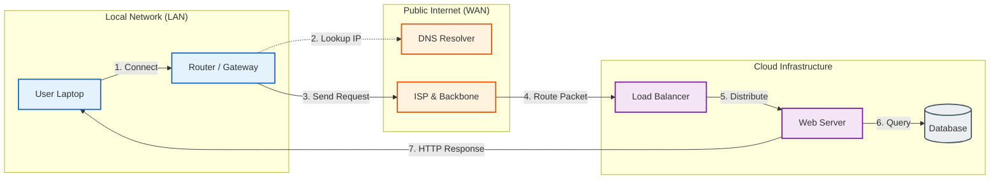

# Networking, the Internet and Web Protocols

If the CPU is the brain, the network is the nervous system. Today, a computer without a network connection operates in isolation, severing it from the distributed computing resources that define modern workflows.

This module explores how devices communicate across networks without a central controller. We'll trace a data packet's journey: from your local machine, through routers and the internet backbone, to the servers hosting the applications you use every day.



---

- [Networking Fundamentals](#networking-fundamentals)
  - [IP Addressing and Subnets](#ip-addressing-and-subnets)
  - [DNS: The Domain Name System](#dns-the-domain-name-system)
  - [The Transport Layer: TCP vs. UDP](#the-transport-layer-tcp-vs-udp)
  - [Lab: Network Detective](#lab-network-detective)
- [Web Protocols](#web-protocols)
  - [The HTTP Request/Response Cycle](#the-http-requestresponse-cycle)
  - [Protocol Evolution](#protocol-evolution)
  - [Transport Layer Security (TLS)](#transport-layer-security-tls)
  - [Lab: Under the Hood](#lab-under-the-hood)
- [Cloud Infrastructure](#cloud-infrastructure)
  - [Service Models](#service-models)
  - [Scalability and Architecture](#scalability-and-architecture)
  - [Lab: Going Live](#lab-going-live)

---

## Networking Fundamentals

*The Infrastructure: Protocols and Addressing*

Networking relies on the OSI Model (Open Systems Interconnection), a conceptual framework that standardizes the functions of a telecommunication system.

We focus here on Layers 3 (Network) and 4 (Transport), which handle addressing and reliable delivery.

### IP Addressing and Subnets

Every device on a network requires a unique identifier to communicate. The Internet Protocol (IP) provides this mechanism.

**IPv4 vs. IPv6**

- **IPv4:**
  - THE legacy standard using 32-bit addresses
  - typically represented in dotted-decimal notation (e.g., `192.168.1.1`)
  - allows for approximately (4.3 billion) unique addresses
  - due to global device proliferation, this space is mathematically exhausted.
- **IPv6:**
  - successor standard using 128-bit addresses
  - represented in hexadecimal (e.g., `2001:0db8:85a3...`)
  - provides a practically infinite address space (340282366920938463463374607431768211456, or 340 undecillion)
  - solves the exhaustion issue and improving routing efficiency
  - adoption slow in EU/US regions, especially in internal company networks

**Public vs. Private Addressing (NAT)**
Not every device needs a globally unique public IP address.

- **Public IP:**
  - Routable on the global internet. Assigned by an ISP.
  - a major company private network can exist behind one publicly routable IP address
- **Private IP:**
  - Reserved ranges (e.g., `192.168.x.x`, `10.x.x.x`)
  - used strictly within a Local Area Network (LAN)
  - these packets are dropped if they attempt to traverse the public internet

**Network Address Translation (NAT):**

- This protocol allows an entire private network to sit behind a single public IP.
- When a device on a LAN accesses the internet, the router modifies the packet header, replacing the private source IP with its own public WAN IP.
- It maintains a *translation table* to route the returning response back to the correct internal device.

**DHCP (Dynamic Host Configuration Protocol)**

- Manually configuring IP addresses is error-prone.
- DHCP automates this.
- When a device joins a network, it broadcasts a request.
- The DHCP server (often the router) responds with a "Lease" containing:
  - A unique IP address.
  - The Subnet Mask (defining the network boundaries).
  - The Default Gateway (where to send traffic destined for the internet).
  - DNS Server addresses.

### DNS: The Domain Name System

- Computers route traffic using IP addresses, but humans prefer memorizable strings.
- DNS is a hierarchical distributed database that resolves human-readable hostnames (e.g., `google.com`) into machine-routable IP addresses (e.g., `142.250.190.46`).

**The Resolution Process:**

1. **Stub Resolver:** The client checks its local cache.
2. **Recursive Resolver:** If cached data is missing, the query is sent to a recursive server (usually provided by the ISP or a public provider like 8.8.8.8).
3. **Root & TLD Servers:** The resolver queries the Root Server (for `.com` location), then the TLD Server, and finally the Authoritative Name Server responsible for the specific domain to retrieve the A Record (IPv4) or AAAA Record (IPv6).

### The Transport Layer: TCP vs. UDP

Once an IP address identifies the destination, the Transport Layer handles the data delivery method.

- **TCP (Transmission Control Protocol):** Connection-oriented.
  - **Reliability:** It guarantees packet delivery. If a packet is lost, it is retransmitted.
  - **Ordering:** It ensures packets are reassembled in the correct sequence.
  - **Mechanism:** Uses a "Three-Way Handshake" (SYN, SYN-ACK, ACK) to establish a session.
  - **Use Cases:** Web browsing (HTTP), Email (SMTP), File Transfer (FTP).

- **UDP (User Datagram Protocol):** Connectionless.
  - **Speed:** It sends packets ("datagrams") without establishing a connection or checking for receipt.
  - **No Overhead:** There is no error correction or retransmission.
  - **Use Cases:** Real-time applications where latency is critical and minor data loss is acceptable, such as Voice over IP (VoIP), online gaming, and live video streaming.

### Lab: Network Detective

Use the command line to inspect the network stack.

1. **Identify Configuration:**

- ```bash
  ipconfig /all
  ```

- Note the IPv4 Address (likely private), Subnet Mask, and Default Gateway.

2. **Verify Connectivity:**

- ```bash
  ping 8.8.8.8
  ```

- This sends ICMP Echo Request packets to Google's DNS to verify the path is active and measure round-trip time (latency).

3. **Trace the Route:**

- ```bash
  tracert google.com
  ```

- This displays every "hop" (router) the packet traverses between the local machine and the destination server.

1. **Manual DNS Lookup:**

- ```bash
  nslookup google.com
  # or `dig google.com
  ```

- View the specific `A` records returned by the configured DNS server.

---

## Web Protocols

*The Language: HTTP and APIs*

While IP and TCP handle connectivity, the Hypertext Transfer Protocol (HTTP) defines the format of the messages exchanged between clients and servers.

It operates at Layer 7 (Application) of the OSI model.

### The HTTP Request/Response Cycle

- HTTP is a request-response protocol.
  - The client sends a request
  - The server processes it and returns a response
- The connection is stateless, meaning each request is independent of the previous one (unless cookies/tokens are used).

**1. The Request Structure**

- **Verb (Method):** Defines the desired action.
  - `GET`: Retrieve a resource (safe, idempotent).
  - `POST`: Submit data to be processed (e.g., form submission).
  - `PUT`: Update/Replace a resource.
  - `DELETE`: Remove a resource.

- **URI (Uniform Resource Identifier):** The path to the specific resource (e.g., `/images/logo.png`).
- **Headers:** Metadata regarding the request (e.g., `User-Agent`, `Accept-Language`, `Authorization`).
- **Body:** Data payload (used primarily in POST/PUT).

**2. The Response Structure**

- **Status Code:** A three-digit integer indicating the result.
  - `2xx` (Success): e.g., `200 OK`, `201 Created`.
  - `3xx` (Redirection): e.g., `301 Moved Permanently`.
  - `4xx` (Client Error): e.g., `400 Bad Request`, `401 Unauthorized`, `404 Not Found`.
  - `5xx` (Server Error): e.g., `500 Internal Server Error`, `503 Service Unavailable`.

- **Headers:** Metadata regarding the response (e.g., `Content-Type`, `Set-Cookie`).
- **Body:** The content (HTML, JSON, XML, Binary).

### Protocol Evolution

- **HTTP/1.1:**
  - The standard for many years.
  - text-based
  - suffers from "Head-of-Line Blocking," where a slow request on a TCP connection holds up subsequent requests.
- **HTTP/2:**
  - Introduced binary framing and multiplexing.
  - allows multiple requests and responses to be interleaved over a single TCP connection
  - significantly reducing latency for modern web pages with many assets.
- **HTTP/3:**
  - Built on top of **QUIC** (which uses UDP instead of TCP)
  - solves TCP-level blocking issues and improves performance on unreliable networks (e.g., switching from Wi-Fi to cellular).

### Transport Layer Security (TLS)

Standard HTTP transmits data in plain text. Any device on the network path can intercept and read the data. **HTTPS** (HTTP Secure) wraps HTTP requests in an encrypted TLS tunnel.

- **Encryption:** Ensures data confidentiality.
- **Integrity:** Ensures data has not been tampered with in transit.
- **Authentication:** Uses Digital Certificates (issued by Certificate Authorities) to prove the server's identity.

### Lab: Under the Hood

Modern browsers include developer tools that act as a visual HTTP client.

1. Open your browser and press **F12** (or right-click and select "Inspect").
2. Navigate to the **Network** tab.
3. Refresh the current page.
4. **Waterfall Analysis:** Observe the sequence of resources being loaded. Note how the browser prioritizes CSS and JavaScript.
5. **Inspect Headers:** Click on the primary document request (usually the first item). Examine the `Response Headers`. Identify the `Content-Type` and `Status Code`.
6. **Simulate Errors:** Try to access a non-existent page to observe a `404` status code.

---

## Cloud Infrastructure

*The Destination: Abstraction and Scale*

"The Cloud" refers to the on-demand delivery of IT resources over the internet with pay-as-you-go pricing. It abstracts the physical hardware away from the user.

### Service Models


Cloud computing is categorized by the level of abstraction provided to the consumer.

- **IaaS (Infrastructure as a Service):** The provider manages the physical hardware (servers, storage, networking). The user manages the Operating System and up.
  - *Examples:* Amazon EC2, Google Compute Engine.
  - *Use Case:* Complete control over the OS and software stack.

- **PaaS (Platform as a Service):** The provider manages the hardware and the Operating System/Runtime. The user manages only the application code and data.
  - *Examples:* Heroku, Google App Engine, Azure App Service.
  - *Use Case:* Rapid application development without OS maintenance.

- **SaaS (Software as a Service):** The provider manages the entire stack. The user accesses the software via a browser.
  - *Examples:* Google Workspace, Salesforce, Slack.
  - *Use Case:* End-user productivity tools.

### Scalability and Architecture

Cloud infrastructure allows for dynamic scaling, differentiating it from traditional static data centers.

**Load Balancing**
A Load Balancer is a reverse proxy that sits in front of multiple servers. It accepts incoming traffic and distributes it across the backend servers to prevent any single server from becoming a bottleneck. This enables **Horizontal Scaling** (adding more servers) rather than Vertical Scaling (making one server larger).

**Content Delivery Network (CDN)**
A CDN is a geographically distributed network of proxy servers. It caches static content (images, CSS, video) at "Edge Locations" physically closer to the user.

- *Mechanism:* When a user in London requests an image hosted in Virginia, the CDN delivers a cached copy from a London server, reducing latency (Ping) and offloading traffic from the origin server.

### Lab: Going Live

Deploy a static web asset to a global CDN.

1. Create a simple `index.html` file on your computer.
2. Use a service like **GitHub Pages**, **Netlify**, or **Vercel**.
3. Upload the file (via Git or drag-and-drop).
4. **Observation:** The service automatically:

- Assigns a public URL.

- Provisions an SSL/TLS Certificate (HTTPS).
- Propagates the file to CDN nodes globally.
