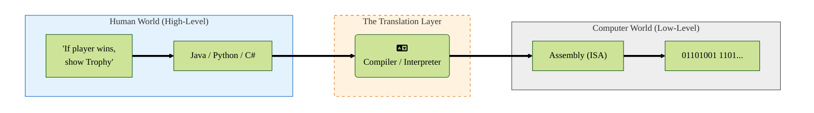
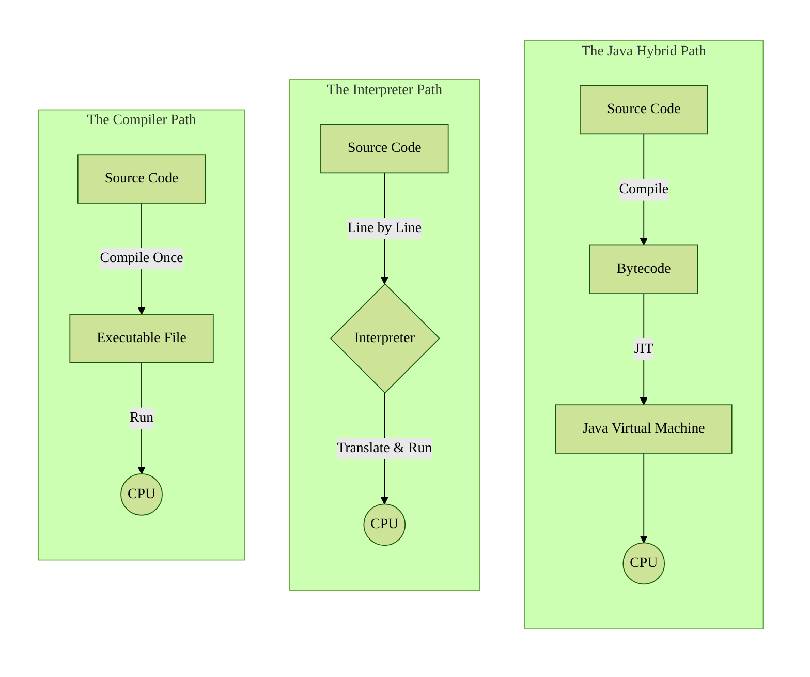
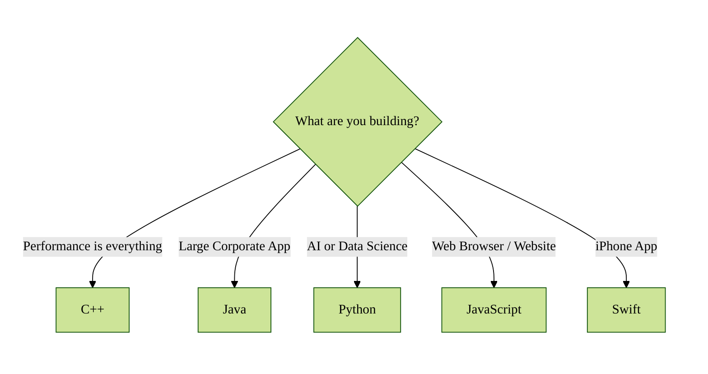
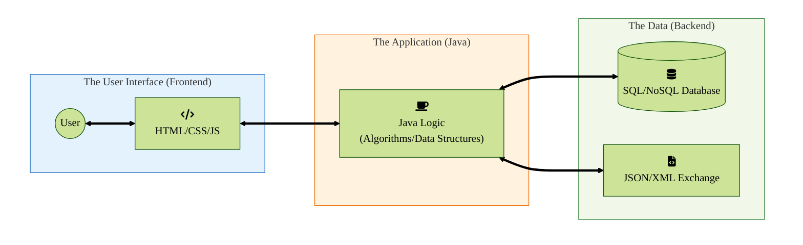

# From Logic to Life: How Code Becomes Action

<!-- The Software Stack: From Source to Silicon -->
<!-- The Digital Bridge: From Human Logic to Machine Action -->

Up until now, we have mainly explored the "physical" side of the computer. We've seen how electricity flows through logic gates, how CPUs follow a strict set of binary instructions, and how data travels across global networks. But a computer without software is like a car without a driver: it is a powerful machine standing perfectly still.

In this chapter, we step into the role of the driver. We will discover how human thoughts and logic are captured in Programming Languages, and how those words on a screen are translated, packaged, and brought to life by the hardware beneath. From the strict rules of Java to the lightning-fast execution of C, we will explore the digital bridge that turns your ideas into reality.

- [From Logic to Life: How Code Becomes Action](#from-logic-to-life-how-code-becomes-action)
  - [The language gap — Lost in translation](#the-language-gap--lost-in-translation)
    - [The great divide](#the-great-divide)
    - [The translator's evolution](#the-translators-evolution)
    - [Why so many languages?](#why-so-many-languages)
  - [The three paths of translation](#the-three-paths-of-translation)
    - [The Compiler (The "pre-baked" method)](#the-compiler-the-pre-baked-method)
    - [The Interpreter (The "live" method)](#the-interpreter-the-live-method)
    - [The Java Hybrid (The "global" method)](#the-java-hybrid-the-global-method)
    - [Comparison](#comparison)
    - [Visualizing the execution flow](#visualizing-the-execution-flow)
  - [The toolbox — Choosing the right language](#the-toolbox--choosing-the-right-language)
    - [The heavyweights: C and C++](#the-heavyweights-c-and-c)
    - [The professional: Java](#the-professional-java)
    - [The swiss Army Knife: Python](#the-swiss-army-knife-python)
    - [The painter: JavaScript](#the-painter-javascript)
    - [Language paradigms: How do we think?](#language-paradigms-how-do-we-think)
  - [Ecosystems — Runtimes \& libraries](#ecosystems--runtimes--libraries)
    - [The Runtime: The living space](#the-runtime-the-living-space)
    - [Libraries: How not to reinvent the wheel](#libraries-how-not-to-reinvent-the-wheel)
    - [Frameworks: The power of the package](#frameworks-the-power-of-the-package)
    - [Choose your weapon](#choose-your-weapon)
  - [The heart of the program — Algorithms \& data structures](#the-heart-of-the-program--algorithms--data-structures)
    - [The container: Data structures](#the-container-data-structures)
    - [The efficiency: Big O notation](#the-efficiency-big-o-notation)
    - [Why this matters](#why-this-matters)
  - [Data outside the code — Storage \& exchange](#data-outside-the-code--storage--exchange)
    - [Data exchange: JSON \& XML](#data-exchange-json--xml)
      - [JSON (JavaScript Object Notation)](#json-javascript-object-notation)
      - [XML (eXtensible Markup Language)](#xml-extensible-markup-language)
    - [Data storage: Databases](#data-storage-databases)
  - [The user view — Frontend \& interfaces](#the-user-view--frontend--interfaces)
    - [The web interface (frontend)](#the-web-interface-frontend)
    - [The desktop interface (UI frameworks)](#the-desktop-interface-ui-frameworks)
  - [The "fullstack" picture](#the-fullstack-picture)

---

## The language gap — Lost in translation

To understand how software works, we first have to admit that humans and computers are terrible at talking to each other.

Imagine you are trying to explain how to play your favorite board game to a giant, incredibly fast, but **infinitely stupid robot**. The robot doesn't understand "set up the board" or "roll the dice." It only understands two things: **Off** and **On** (0 and 1).

### The great divide

In Chapter 2, we saw that the CPU only speaks **machine code**. If you wanted to tell the computer to add two numbers, you would have to give it a string of numbers like ```11010100 00011010```. For a human, writing an entire game this way would be impossible. We would lose our minds before we finished the first menu screen.

On the other hand, humans speak high-level languages. We think in concepts like "If the player clicks this button, then show them their inventory."

Programming languages are the bridge across this gap. They allow us to write instructions in a way that makes sense to our brains, while providing a clear path to translate those instructions into the "0s and 1s" our computers require.

### The translator's evolution

Just like human languages evolved from simple grunts to complex poetry, programming languages have evolved too:

- **Low-Level (The Machine's View)**: Languages like Assembly. They are very close to the hardware. You have to manage every tiny bit of memory yourself. It's like building a car by forging your own bolts and screws.

- **High-Level (The Human's View)**: Languages like Java, Python, or C#. They allow you to focus on the logic. The language handles the "boring" stuff (like where exactly in the hardware a number is stored) so you can focus on the "fun" stuff (the rules of your game).



### Why so many languages?

You might wonder: "If the goal is just to talk to the computer, why do we have hundreds of different languages?"

Think of it like tools in a workshop.

- C++ is a high-powered circular saw: dangerous if you aren't careful, but incredibly fast and precise.

- Python is like a glue gun: easy to use, great for sticking things together quickly, but not what you'd use to build a skyscraper.

- Java is like a professional construction kit: it has strict rules to make sure the building doesn't fall down, making it perfect for big teams building complex systems.

## The three paths of translation

Once you have written your code, it needs to be translated into machine code (the 0s and 1s) that we discussed in Chapter 2. However, not every language takes the same path to get there. Each programming language uses one of three main translation methods, that we'll cover below. As a developer, you'll want to choose which method and language to use, depending on what the software needs to do: run fast, be easy to change, or run on any device.

### The Compiler (The "pre-baked" method)

Languages like C and C++ use a compiler. Think of this like a translator who takes an entire book and translates the whole thing from English to Dutch before anyone ever reads it.

How it works: You write the code, and then you run a "Compiler" program. It checks your entire project for errors and creates a separate, finished file (like an .exe on Windows).

The Benefit: Since the translation is already done, the CPU can run the instructions at maximum speed.

The Downside: If you change even one line of code, you have to re-compile the whole thing. Also, a program compiled for a Windows PC won't work on a Mac; you have to translate it specifically for each "platform."

### The Interpreter (The "live" method)

Languages like Python and JavaScript use an Interpreter. This is like a live translator sitting next to the CPU, translating your instructions line-by-line as the program is running.

How it works: There is no finished "translated file." Instead, you run the Source Code directly. The Interpreter reads the first line, translates it, the CPU does it, and then the Interpreter moves to the second line.

The Benefit: It is very flexible. You can change your code and run it immediately without waiting.

The Downside: It is generally slower than compiled code because the computer is doing two jobs at once: translating and running.

### The Java Hybrid (The "global" method)

Since you are learning to code in Java at this moment, you are using a clever middle ground. Java was designed with the motto: "Write Once, Run Anywhere." To achieve this, it uses a two-step process involving Bytecode and a Virtual Machine (VM).

Step 1: Your Java code is compiled, but not into Machine Code. It is turned into Bytecode. This is a "universal" language that humans can't read, but it isn't quite ready for the CPU yet either.

Step 2: When you run the program, the Java Virtual Machine (JVM) takes that Bytecode and translates it for your specific computer (Windows, Mac, or Linux) using something called a JIT (Just-In-Time) Compiler.

### Comparison

| Method | Languages | Speed | Flexibility |
| -------- | :---------: | ------- | ------------- |
| Compiled | C, C++, Rust | Fastest | Low (Must re-compile) |
| Interpreted | Python, JS, PHP | Slower | High (Run instantly) |
| Hybrid | Java, C# | Fast (JIT) | Medium (Highly portable) |

### Visualizing the execution flow



## The toolbox — Choosing the right language

If every programming language eventually turns into the same 0s and 1s for the CPU, why do we have so many? The answer is simple: different tasks require different tools. You wouldn't use a sledgehammer to hang a small picture frame, and you wouldn't use a screwdriver to break through a concrete wall.

In the world of software, we choose a language based on its "personality", i.e. its strengths, its safety features, and where it is intended to run.

### The heavyweights: C and C++

| C, C++ | Description |
| ------------- | ------------- |
| Personality | The "Mechanics". These languages give the programmer direct control over the computer's hardware and memory. |
| Use Case | High-performance software where every millisecond counts. |
| Examples | Triple-A video games (like Call of Duty or Elden Ring), Operating Systems (Windows/Linux kernels), roboitcs, and flight control systems. |
| The Catch | They are "dangerous." The language won't stop you from making a mistake that crashes the entire computer. |

### The professional: Java

| Java | Description |
| ------------- | ------------- |
| Personality | The "Architect". Java is designed for stability and safety. It uses strict rules (like a blueprint) to ensure that different parts of a massive project fit together perfectly. |
| Use Case | Large-scale "Enterprise" software. |
| Examples | Banking systems, Android apps, and the backend "brains" of huge websites like LinkedIn or Amazon. |
| The Catch | It can feel "wordy" or strict compared to other languages, requiring you to write more lines of code to get started. |

### The swiss Army Knife: Python

| Python | Description |
| ------------- | ------------- |
| Personality | The "Assistant." Python focuses on being easy for humans to read and write. It handles the complicated "computer stuff" behind the scenes so the human can focus on the logic. |
| Use Case | Intelligence and Automation. |
| Examples | Artificial Intelligence (AI), Data Science, and simple scripts to automate boring office tasks. |
| The Catch | Because it is interpreted and focuses on ease-of-use, it is significantly slower than C++ or Java for heavy calculations. |

### The painter: JavaScript

| JavaScript | Description |
| ------------- | ------------- |
| Personality | The "Performer." Originally built only for web browsers, JavaScript is what makes websites interactive. |
| Use Case | The Web. (frontend and backend) |
| Examples | Anything that moves, pops up, or updates on a webpage (like your Facebook feed or Google Maps). |
| The Catch | Because it was built quickly for the web, it has some "quirky" behaviors that can sometimes confuse beginners. |

### Language paradigms: How do we think?

Beyond the name of the language, we also categorize them by how they force you to think. These concepts are called "paradigms":

- Imperative (The Recipe): You give the computer a list of steps to follow in order. "First do this, then do that." (C is very imperative).

- Object-Oriented (The Ecosystem): You organize your code into classes and objects. Every object has its own properties and values and can do actions with them. You are learning this in Java right now (e.g. a Student object has a name and a grade).

- Functional (The Math): You treat the program like a series of mathematical equations. It's very predictable and great for complex data processing.



## Ecosystems — Runtimes & libraries

In the early days of computing, if you wanted to draw a circle on the screen, you had to write code to tell the hardware exactly which pixels to turn on. Today, no one does that. Programmers rely on ecosystems; a massive collection of pre-built tools and environments that do the "heavy lifting" for us.

### The Runtime: The living space

As we saw in the Java Hybrid model, code often doesn't run directly on the hardware. It runs inside a Runtime Environment.

Think of the Runtime as a protective "bubble" or a specialized workshop where your code lives. It provides the air and tools your program needs to breathe:

- The Java Virtual Machine (JVM): The runtime for Java.
- The CLR (Common Language Runtime): The runtime for C# and .NET.
- CPython: The most common runtime for Python.

Why do we need them? Runtimes handle the "dirty work" like memory management. In Java, when you are done using a piece of data, the JVM automatically cleans it up (this is called garbage collection). In languages without a runtime (like C), if you forget to clean up your data, your computer will eventually run out of memory and crash! This is another example of the *catch* that was mentioned before when talking about the C and C++ languages.

### Libraries: How not to reinvent the wheel

A library is a collection of pre-written code that you can "borrow" to solve common problems.

If you are building a board game app in Java, you don't want to spend three weeks writing code just to make a window pop up or to play a "dice roll" sound effect. Instead, you import a few libraries that provide these functionalities.

- Standard Libraries: These come built-in with the language (e.g., Java's Math library for complex calculations).

- Third-Party Libraries: These are built by other people.
  - Want to make a 2D game in Java? Use JavaFX or Pygame.
  - Want to do complex AI in Python, Java, ...? Use TensorFlow.
  - Want to build a Windows user interface in .NET? Use WPF.
  - ...

Choosing a library depends on a few parameters, like which language you are using, what you're trying to build and possibly earlier experience you have. Making the right choice is important, as it can save you a lot of time.

### Frameworks: The power of the package

When you combine a programming language, a runtime, and a set of libraries, you get a **framework**. This is a complete "construction kit" for a specific type of project. For example, if you want to build a website, you don't just use Python; but you could use the Django framework, which gives you all the tools you need in one box.

### Choose your weapon

When you choose a programming language, you aren't just choosing the syntax (how to write the words); you are choosing the ecosystem. A language with a "rich" ecosystem (like Java or Python) is popular because there is a library for almost anything you can imagine, meaning you have to write less code to get big results. Knowing which ecosystem, libraries and frameworks to use for any specific problem, is an invaluable asset to each aspiring or experienced developer.

## The heart of the program — Algorithms & data structures

Even the most powerful programming language is just a set of instructions. The true "intelligence" of a piece of software comes from how it handles information.

To write efficient code, you must master two concepts: data structures (how you organize information) and algorithms (the logic you use to process that information).

### The container: Data structures

A data structure is simply a way of organizing information in a computer's memory so we can use it efficiently in our code. In general, you will encounter two main "shapes" of data in your first programming courses:

- List (The Queue): Think of this like a line of people waiting at a store. If you want to find "Sarah," you have to start at the front and ask every person, "Are you Sarah?" until you find her. If Sarah is the 1,000,000th person in line, it takes a long time.

- Key-Value Map (The Locker): Think of this like a wall of lockers. Each locker has a unique number (key) and contains an item (value). If you know Sarah is in locker #502, you walk straight to it. It doesn't matter if there are 10 lockers or 10 million; finding her takes the same amount of time.

### The efficiency: Big O notation

How do we measure if a program is "good"? We don't use a stopwatch, because a fast computer will always beat a slow one. Instead, we count the number of steps the algorithm takes as the amount of data grows. We call this Big O notation.

| Factor | Description |
| ------ | -----|
| O(1) | Constant time: The "Locker" approach. One step to find your data, no matter how much you have. This is the gold standard. |
| O(n) | Linear time: The "Line-up" approach. If you have n items, it might take n steps to find what you need.|
| O(n²) | Quadratic time: The "Slow Zone." This often happens when you have a loop inside a loop (like comparing every item in a list to every other item). If you have 1,000 items, you might take 1,000,000 steps! |

This notation can be used to compare algorithms. Think about a sorting algorithm that can sort a list of products based on their price. (more on that in the FYI section of the course!) These kind of algorithms are widely used throughout all kinds of applications, so it is crucial to determine the one that manages the sorting process in the fastest way possible. Using the big O notation, there's a tool that can help us compare different solutions.

In this course, we will not go into details about this big O notation and the math behind it. Although, as an aspiring computer science wizard, it is important to know this notation and grasp its meaning. In some future courses, it may become more and more important.

### Why this matters

As a programmer, your job isn't just to "make the code work". Your job is to create functional applications that are efficient, scalable and future-proof.

- Using a list works fine when you have 10 board games in your database.
- Using a list will also crash your app when you have 10 million users.

Analyze your solution from different perspectives, to determine if it is sufficiently qualitative. When in doubt, try different approaches! This will make you understand your application better and will increase your skill level by gathering more and more experience as a developer.

## Data outside the code — Storage & exchange

Code doesn't live in a vacuum. Most of the time, our programs need to talk to other programs or remember information even after the computer is turned off. To do this, we need standardized ways to exchange data and store data.

### Data exchange: JSON & XML

When two different programs (like a Java app and a web server) talk to each other, they need a common language that isn't binary. They often use text-based formats.

There are several options here, but we'll cover the 2 most used formats for now.

#### JSON (JavaScript Object Notation)

The modern champion. It is lightweight, easy for humans to read, and very easy for computers to turn into **objects**.

Example:  

```json
{
  "name": "Zebedee",   
  "score": 450
}
```

#### XML (eXtensible Markup Language)

The older, more formal cousin. It uses tags to structure data. It is "wordier" than JSON but very good for complex documents. If you've learned a bit about HTML, you can notice the same rigid structure that is used to store data.

Example:

```xml
  <player>
    <name>
      Zebedee
    </name>
    <score>
      450
    </score>
  </player>
```

### Data storage: Databases

When we need to save millions of records permanently, we use a database. Just like programming languages, there are different tools for different types of data:

- SQL (Relational): Data is stored in strict, organized tables with rows and columns. Think of it like a giant collection of Excel sheets that are linked together.
  - Best for: Financial systems or anything where the data must follow strict rules and specific queries are required to retrieve specific combinations of the data.

- NoSQL (Non-Relational): Data is stored in flexible documents, often in JSON format. There are no strict tables; you can just throw data in and retrieve it quickly.
  - Best for: Social media feeds or big data where the "shape" of the data changes often.

## The user view — Frontend & interfaces

Finally, we reach the part of the software that people actually see. Most users will never see your Java logic, they will most likely only interact with the (user) interface.

### The web interface (frontend)

If your web application runs in a browser, it uses three specific languages that work together:

| Language | Role | Description |
| -------- | -------- | ----------- |
| HTML | The skeleton (Structure) | It defines where the text, buttons, and images go. |
| CSS | The skin (Style) | It defines the colors, fonts, and layout. |
| JavaScript | The brain (Action) | It makes the page interactive (e.g., what happens when you click a button). |

When building a web app, you could choose to create all HTML, CSS, JavaScript code separately, which you are already learning in the Web-related courses. More experienced developers will often use frameworks like React, Vue, Svelte, ... to be able to add more structure to their code. While these frameworks might look a bit more complex at first, they offer you a lot of pre-built tools and other handy and time-saving features to create a nice programming experience that doesn't feel tedious and repetitive.

### The desktop interface (UI frameworks)

A lot of programming languages use their own toolkits to build windows and button, like ```WPF``` for C#, ```pygame``` for Python games or ```JavaFX``` in Java. These frameworks act as the interface between your code's logic and the user's mouse clicks.

## The "fullstack" picture

When you combine all these layers, you create what is known as a fullstack application. It consists of a user interface (UI), the business logic (which could run on a remote server or in the cloud) and the data storage. Some developers choose to specialize in one of these components, others call themselves fullstack developers.

In the IT world, a "fullstack developer" is someone who can work across this entire spectrum. They don't just write the Java code (the "backend"); they also understand how to design the screens the user touches (the "frontend") and how to structure the filing cabinets where the data lives (the database).



You have now seen the entire journey. You start with an idea (logic), use a language (Java) to write it down (algorithm and code), choose the right container (data structure), and let the runtime (JVM) translate any code to be run by the hardware.

By connecting this logic to databases and user interfaces, you turn a simple math calculation into a living piece of software.
