# Software Development and the Engineering Lifecycle

Writing code is a solitary activity; building software is a social one. There is a fundamental distinction between **Programming** (writing algorithms) and **Software Engineering** (building products).

This module introduces the industrial process of software creation. We move away from the view of code as static text and examine it as a fluid product that moves through a "supply chain" - from an abstract human idea, through rigorous assembly and testing, to a live application serving users.

```mermaid
graph LR
    %% Styling
    classDef plan fill:#fff9c4,stroke:#fbc02d,stroke-width:2px;
    classDef dev fill:#e1f5fe,stroke:#0277bd,stroke-width:2px;
    classDef pipe fill:#f3e5f5,stroke:#7b1fa2,stroke-width:2px;
    classDef live fill:#e8f5e9,stroke:#2e7d32,stroke-width:2px;

    %% 1. Planning
    subgraph Plan [Planning]
        Story[User Story]:::plan
        Board[Kanban Board]:::plan
    end

    %% 2. Coding
    subgraph Code [Development]
        Branch[Feature Branch]:::dev
        PR[Pull Request / Review]:::dev
    end

    %% 3. The Factory
    subgraph Pipeline [CI/CD Pipeline]
        Build[CI: Build & Test]:::pipe
        Deploy[CD: Auto Deploy]:::pipe
    end

    %% 4. Reality
    subgraph Prod [Production]
        App[Live App]:::live
        User((End User)):::live
    end

    %% The Flow
    Story --> Board
    Board -- "Pick up task" --> Branch
    Branch -- "Commit" --> PR
    PR -- "Merge" --> Build
    Build -- "Pass" --> Deploy
    Deploy --> App
    App --> User

    %% Feedback Loop
    User -. "Feedback" .-> Story

```



---

- [Agile Planning and Roles](#agile-planning-and-roles)
  - [Roles and Responsibilities](#roles-and-responsibilities)
  - [Artifacts and Visualization](#artifacts-and-visualization)
- [Collaborative Git (GitFlow)](#collaborative-git-gitflow)
  - [Branching Strategy](#branching-strategy)
  - [The Pull Request (PR)](#the-pull-request-pr)
  - [Lab: The Conflict](#lab-the-conflict)
- [CI/CD and Automation](#cicd-and-automation)
  - [Continuous Integration (CI)](#continuous-integration-ci)
  - [Continuous Deployment (CD)](#continuous-deployment-cd)
  - [The Pipeline Configuration](#the-pipeline-configuration)
- [Quality Assurance (QA)](#quality-assurance-qa)
  - [The Testing Pyramid](#the-testing-pyramid)
- [Manual vs. Automated Testing](#manual-vs-automated-testing)
  - [Manual Testing](#manual-testing)
  - [Automated Testing](#automated-testing)
  - [The Goal: Continuous Confidence](#the-goal-continuous-confidence)
  - [Lab: Break the Build](#lab-break-the-build)

---

## Agile Planning and Roles

*The Context: Requirements Engineering*

Before a single line of code is written, the team must define *what* is being built. In modern software engineering, this is rarely defined by a massive, static specification document (Waterfall). Instead, it is defined iteratively using **Agile** methodologies.


### Roles and Responsibilities

Software teams are typically cross-functional, consisting of distinct roles that balance business value against technical feasibility.

- **Product Owner (PO):** Represents the stakeholder (customer). They define **What** to build and prioritize features based on business value. They are the gatekeepers of the requirements.
- **The Development Team:** Represents the engineering talent. They define **How** to build it. They estimate complexity and own the technical implementation.

### Artifacts and Visualization


- **User Stories:** Requirements are captured in a specific format that emphasizes the user's goal rather than the system's function.
  - *Format:* "As a `<role>`, I want `<feature>` so that `<value>`."
  - *Example:* "As a **shopper**, I want **a shopping cart** so that **I can buy multiple items at once**."
- **The Kanban Board:**
  - A visual management tool used to track the flow of work. Columns typically include *To Do*, *In Progress*, *Review*, and *Done*.
- **WIP Limits (Work In Progress):** A critical concept in Kanban. Teams limit how many tickets can be in the "In Progress" column simultaneously to prevent context switching and bottlenecking.

---

## Collaborative Git (GitFlow)

*The Interaction: Version Control at Scale*

In a solo project, you work directly on the main codebase. In a team setting, modifying the live code directly is reckless. Teams use **Branching Strategies** to manage parallel development.

### Branching Strategy


Most teams follow a convention known as **GitFlow** or **Feature Branch Workflow**.

- **`Main` (or `Master`):** The "Source of Truth." This branch always contains stable, production-ready code. No one commits directly to Main.
- **`Feature/` Branches:** Temporary sandboxes. When a developer starts a task (e.g., "Add Login"), they create a new branch from Main. All work happens here, isolated from the rest of the team.

### The Pull Request (PR)

The **Pull Request** is the critical quality gate in the lifecycle. It is a request to merge code from a `Feature` branch into `Main`.

- **Code Review:** Before the merge happens, other engineers review the code. They look for logic errors, security flaws, and style violations. This is the primary mechanism for knowledge sharing within a team.
- **Merge Conflicts:** If Developer A and Developer B both modify line 42 of the same file, Git cannot automatically resolve the difference. The developers must manually intervene to decide which code stays.

### Lab: The Conflict

**Scenario:** Two students simulate a collision.

1. Both students clone the same shared repository.
2. Student A edits `index.html` line 10 to say "Hello Alpha".
3. Student B edits `index.html` line 10 to say "Hello Beta".
4. Student A pushes their change successfully.
5. Student B tries to push and is rejected by the server.
6. **Resolution:** Student B must `pull`, manually edit the file to resolve the conflict markers (`<<<<`, `====`, `>>>>`), and push again.

---

## CI/CD and Automation

*The Factory: Continuous Integration and Deployment*

The "Works on my machine" problem occurs when code runs on a developer's laptop but fails in production due to environmental differences (different OS, library versions, or database configurations). To solve this, we rely on **Automation Servers**.

### Continuous Integration (CI)

CI is the practice of automating the integration of code changes from multiple contributors into a single software project.

- **The Trigger:** When a developer opens a Pull Request, the CI server (e.g., GitHub Actions, Jenkins, GitLab CI) automatically wakes up.
- **The Build:** The server spins up a fresh, neutral environment (a container) and attempts to compile the code.
- **The Test:** The server runs the automated test suite.
- **The Gate:** If the build fails or tests result in errors, the Pull Request is blocked. The code literally cannot be merged until it is fixed.

### Continuous Deployment (CD)

CD extends CI. If the CI process passes (Green Checkmark), the pipeline automatically deploys the code to the production server. This removes human error from the release process.

### The Pipeline Configuration

Pipelines are defined as code (e.g., `.github/workflows/main.yml`).

```yaml
name: Production Build
on: [push]
jobs:
  build-and-test:
    runs-on: ubuntu-latest
    steps:
      - name: Check out code
        uses: actions/checkout@v2
      - name: Install dependencies
        run: npm install
      - name: Run Tests
        run: npm test

```

---

## Quality Assurance (QA)

*The Safety Net: Verification Layers*

Software testing is not a single activity; it is a layered strategy designed to catch bugs at different costs and speeds.

### The Testing Pyramid


- **Unit Tests (The Base):**
  - *Scope:* Tests a single function or class in isolation.
  - *Speed:* Extremely fast (milliseconds).
  - *Example:* Does `calculateTax(100)` return `21`?
- **Component Tests (The Middle):**
  - *Scope:* Tests a larger section of the system (like a microservice or module) in isolation. External dependencies (like the database or other APIs) are usually "mocked" (faked) to test complex logic without network overhead.
  - *Speed:* Fast to Moderate.
  - *Example:* Does the "Shopping Cart" module correctly calculate totals and apply discounts when we simulate adding three specific items?
- **Acceptance Tests (The Middle):**
  - *Scope:* Verifies that the software meets the agreed-upon business requirements (User Stories). These focus on *behavior* rather than code structure and often use plain English syntax (Gherkin).
  - *Speed:* Moderate.
  - *Example:* "Given a user with a valid subscription, When they click 'Download', Then the file starts downloading."
- **End-to-End (E2E) Tests (The Tip):**
  - *Scope:* Tests the full application flow from the user's perspective, often controlling a real browser (using tools like Selenium or Cypress).
  - *Speed:* Slow and brittle.
  - *Example:* Open Chrome, click "Login", type password, expect to see "Welcome Dashboard".
- **Smoke Tests (The Sanity Check):**
  - *Scope:* Broad but shallow tests to verify the system is stable enough for further testing ("Does it catch fire when turned on?").
  - *Speed:* Very fast.
  - *Example:* Does the application launch without crashing? Does the main landing page load?

## Manual vs. Automated Testing

*The Strategy: Balancing Speed and Intuition*

Modern quality assurance is not a binary choice between human and machine; it is a strategic combination of both.

### Manual Testing

**The Explorer.** Manual testing involves a human sitting in front of the application and interacting with it like an end-user.

- **Scope:** Usability, visual layout, "look and feel," and complex edge cases that are hard to script.
- **Pros:** Humans are creative. They find bugs that scripts miss (e.g., "This button color looks wrong" or "This workflow feels confusing").
- **Cons:** Slow, expensive, and prone to fatigue or error during repetitive tasks.

### Automated Testing

**The Robot.** Automated testing uses software tools to execute pre-scripted tests on the application without human intervention.

- **Scope:** Regression testing (checking that old code still works), API validation, load testing, and repetitive calculations.
- **Pros:** Instant feedback, extremely consistent, and runs 24/7. It is the backbone of CI/CD pipelines.
- **Cons:** "Brittle" (tests break easily if the UI changes), requires coding skills to maintain, and only checks exactly what you tell it to check.

### The Goal: Continuous Confidence

The industry goal is not necessarily "100% automation," but **Continuous Feedback**.

- **Shift Left:** We automate the repetitive checks (Unit/Component tests) to run every time code is saved. This catches bugs early when they are cheap to fix, rather than in Production.
- **The Balance:** We automate the **checking** (verifying facts and regression) so humans can focus on the **testing** (exploring behaviors and usability).
- **The Result:** Deploying to production becomes a boring, routine event because the automated suite has already proven the system's stability.

### Lab: Break the Build

**Scenario:** Observing the CI Pipeline in action.

1. Students are given a repository with a pre-configured GitHub Actions pipeline.
2. **Task:** Introduce a syntax error (e.g., remove a semicolon or misspell a function name) and push the code.
3. **Observation:** Navigate to the "Actions" tab in GitHub. Watch the pipeline fail (Red X).
4. **Fix:** Correct the code and push again. Watch the pipeline succeed (Green Check).
