# CPU Architecture and Instruction Set Architectures (ISA)

- [0. From programs to hardware: why we need a model](#0-from-programs-to-hardware-why-we-need-a-model)
- [1. Von Neumann and Harvard Architectures](#1-von-neumann-and-harvard-architectures)
  - [1.1 Classic Von Neumann idea](#11-classic-von-neumann-idea)
  - [1.2 Harvard architecture](#12-harvard-architecture)
- [2. Inside a Simple CPU](#2-inside-a-simple-cpu)
  - [2.1 Register file](#21-register-file)
  - [2.2 ALU (Arithmetic Logic Unit)](#22-alu-arithmetic-logic-unit)
  - [2.3 Program Counter (PC)](#23-program-counter-pc)
  - [2.4 Control unit](#24-control-unit)
  - [2.5 Simplified datapath diagram](#25-simplified-datapath-diagram)
- [3. Fetch - Decode - Execute Cycle](#3-fetch---decode---execute-cycle)
  - [3.1 Fetch](#31-fetch)
  - [3.2 Decode](#32-decode)
  - [3.3 Execute](#33-execute)
  - [3.4 Loop view](#34-loop-view)
- [4. A Minimal Instruction Sequence Example](#4-a-minimal-instruction-sequence-example)
- [5. Instruction Set Architecture (ISA)](#5-instruction-set-architecture-isa)
  - [5.1 What the ISA defines](#51-what-the-isa-defines)
  - [5.2 ISA vs microarchitecture](#52-isa-vs-microarchitecture)
- [6. Instruction Formats and Addressing Modes](#6-instruction-formats-and-addressing-modes)
  - [6.1 Simple instruction formats](#61-simple-instruction-formats)
  - [6.2 Common addressing modes](#62-common-addressing-modes)
- [7. Types of Instructions](#7-types-of-instructions)
  - [7.1 Arithmetic and logical](#71-arithmetic-and-logical)
  - [7.2 Data movement](#72-data-movement)
  - [7.3 Control flow](#73-control-flow)
- [8. Real ISAs: x86, ARM, and RISC-V](#8-real-isas-x86-arm-and-risc-v)
  - [8.1 x86 and x86-64](#81-x86-and-x86-64)
  - [8.2 ARM](#82-arm)
  - [8.3 RISC-V: open ISA and current status](#83-risc-v-open-isa-and-current-status)
  - [8.4 RISC-V example](#84-risc-v-example)
  - [8.5 RISC vs CISC in context](#85-risc-vs-cisc-in-context)
- [9. Assembly vs Machine Code](#9-assembly-vs-machine-code)
  - [9.1 Machine code: what memory actually stores](#91-machine-code-what-memory-actually-stores)
  - [9.2 Assembly: human readable representation](#92-assembly-human-readable-representation)
  - [9.3 Example: simple mapping](#93-example-simple-mapping)
- [10. High Level Code to Assembly to Machine](#10-high-level-code-to-assembly-to-machine)
  - [10.1 Conceptual pipeline](#101-conceptual-pipeline)
  - [10.2 Example](#102-example)
- [11. Turing Completeness and CPUs](#11-turing-completeness-and-cpus)
  - [11.1 Idea of Turing completeness](#111-idea-of-turing-completeness)
  - [11.2 Why general purpose CPUs are Turing complete](#112-why-general-purpose-cpus-are-turing-complete)
  - [11.3 Tiny example of Turing complete core pieces](#113-tiny-example-of-turing-complete-core-pieces)
- [12. A More Involved Example Program](#12-a-more-involved-example-program)

---

## 0. From programs to hardware: why we need a model

Everything in this module is about one simple question:

> When you run a program, what actually happens inside the machine?

Take a trivial line of Python:

```python
x = x + 1
````

From a beginner view this is just "add 1 to x". Under the surface:

1. The Python interpreter is a program itself, running as a process on your operating system.
2. That interpreter eventually needs to make the CPU do work:

   - load the current value of `x`
   - add 1
   - store the result somewhere in memory

To understand that last step, you need:

- a mental model of the hardware (CPU, memory, buses)
- a model of how the CPU is driven by instructions
- some understanding of what an instruction set is

The chain looks like this:

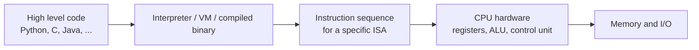

You have already seen logic gates and binary numbers. Those live at the very bottom: transistors and bit patterns. Here we build the bridge from that low level to:

- the CPU as a box that executes sequences of instructions
- the ISA as the language those instructions are written in
- concrete ISA families (x86, ARM, RISC-V) that exist in real hardware

The first step in that bridge is a simple architectural model of a computer. That model is usually called the Von Neumann architecture.

---

## 1. Von Neumann and Harvard Architectures

### 1.1 Classic Von Neumann idea

The classic machine model behind most general purpose computers:

- One main memory holds both:

  - instructions (machine code)
  - data (numbers, text, etc.)
- A CPU repeatedly:

  - reads an instruction from memory
  - executes it
  - updates its internal state (registers, program counter, memory)


<p align="center">John Von Neumann in front of his EDVAC Electronic Computer, 1949.</p>

Historically this was a big step: very early machines had the "program" hard wired as cables or switches. The Von Neumann idea (John von Neumann, 1945) is that the program is just data in memory, so a machine can:

- load new programs without rewiring
- even modify its own code at runtime if needed

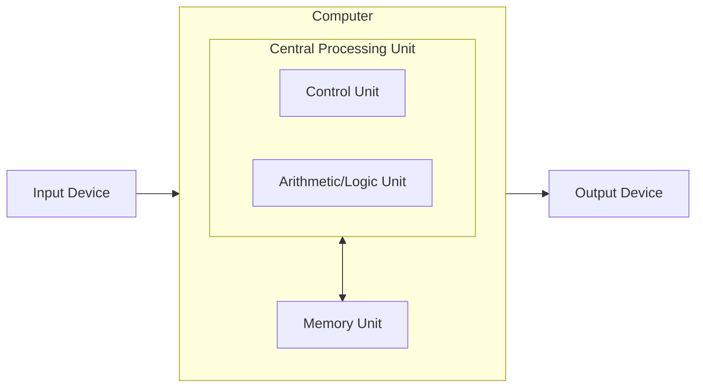

Key consequences:

- Instructions and data are just bit patterns in memory.
- There is a single path (bus) between CPU and memory for both.
- A bug that writes to a wrong address can overwrite instructions or data.
- Self modifying code is possible, although not common in modern high level software.

You can map most PCs, laptops, servers, game consoles, and smartphones conceptually to this model, even if internally they are optimized and more complex.

### 1.2 Harvard architecture

Harvard architecture separates instruction and data memory:

- One memory (or bus) for instructions.
- One memory (or bus) for data.
- CPU can fetch an instruction and read or write data in parallel.

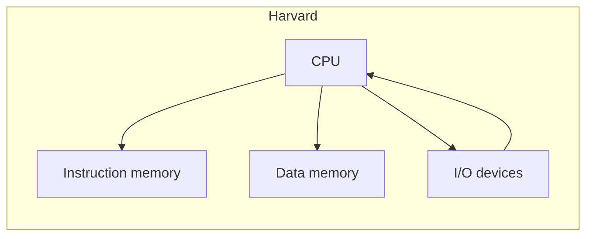

Where it appears in practice:

- Many microcontrollers and Digital Signal Processors use a strict Harvard design for speed.
- Popular examples include:
  - **Arduino boards** (AVR-based): AVR microcontrollers use a Harvard architecture with separate program and data memory spaces.
  - **ESP32**: Xtensa-based dual-core microcontroller with Harvard-style separation of instruction and data buses.
  - **ARM Cortex-M series**: widely used in embedded systems, employing a modified Harvard architecture with separate instruction and data buses internally.
  - **PIC microcontrollers** (Microchip): classic Harvard architecture with separate code and data memory.
  - **Texas Instruments DSPs**: many C2000 and C5000 series DSPs (Digital Signal Processors - specialized chips optimized for fast math operations on streams of data, such as filtering audio or processing radar signals) use Harvard architecture for parallel instruction fetch and data access.
- You can store program code in non volatile flash memory and data in RAM.
- Instruction memory can be read only while data memory is read/write.

Caches are small, extremely fast memory buffers located between the CPU and main memory that store frequently accessed instructions and data to reduce the time the CPU spends waiting for memory.

Even in a Von Neumann CPU, caches are often split into:

- instruction cache (I-cache)
- data cache (D-cache)

plus sometimes separate buses. This is called a modified Harvard architecture.

For this course:

- Use Von Neumann as the basic mental model.
- Know Harvard exists and is common in embedded and signal processing.
- Understand that modern CPUs often mix ideas from both.

---

## 2. Inside a Simple CPU

A basic CPU has a small set of key building blocks. You will see them again in operating systems, compilers, and virtualization.

### 2.1 Register file

Registers are tiny storage cells inside the CPU:

- Faster than RAM by orders of magnitude.
- Used for:

  - holding temporary values
  - passing arguments to instructions
  - keeping results

Typical roles:

- General purpose registers (`R0`, `R1`, `R2`, ...).
- Special registers:

  - `PC` (Program Counter / Instruction Pointer): address of next instruction
  - `SP` (Stack Pointer): address of top of the current stack
  - `FLAGS` / Status register: condition codes (Zero, Carry, Negative, Overflow, etc.)
  - `IR` (Instruction Register): holds the currently fetched instruction bits for decoding

We talk about the "register file" as the collection of all registers that the ISA exposes to software.

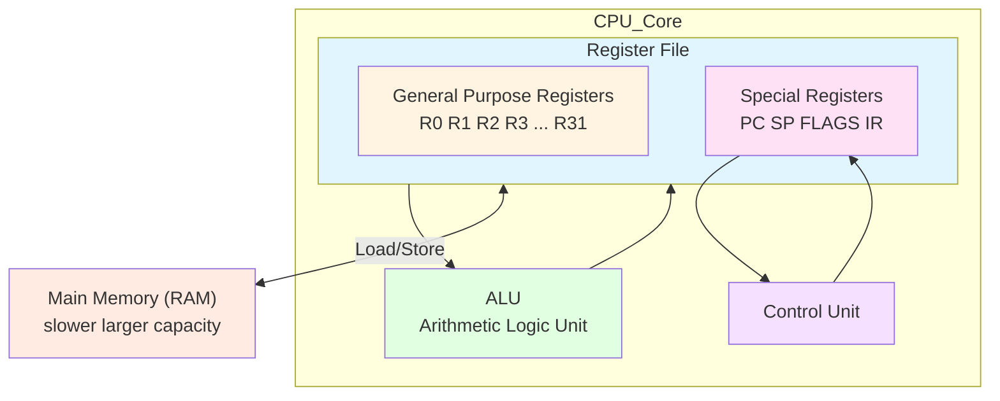

### 2.2 ALU (Arithmetic Logic Unit)

The **ALU** performs the basic operations:

- arithmetic: `ADD`, `SUB`, sometimes `MUL`, `DIV`
- logic: `AND`, `OR`, `XOR`, `NOT`
- shifts and rotates: `SHL`, `SHR`, `ROL`, `ROR`
- comparisons: often set flags: `Z` (zero), `N` (negative), `C` (carry), `V` (overflow)

The ALU is built on top of the logic gates and adders from earlier modules. It is the place where bits actually get transformed.

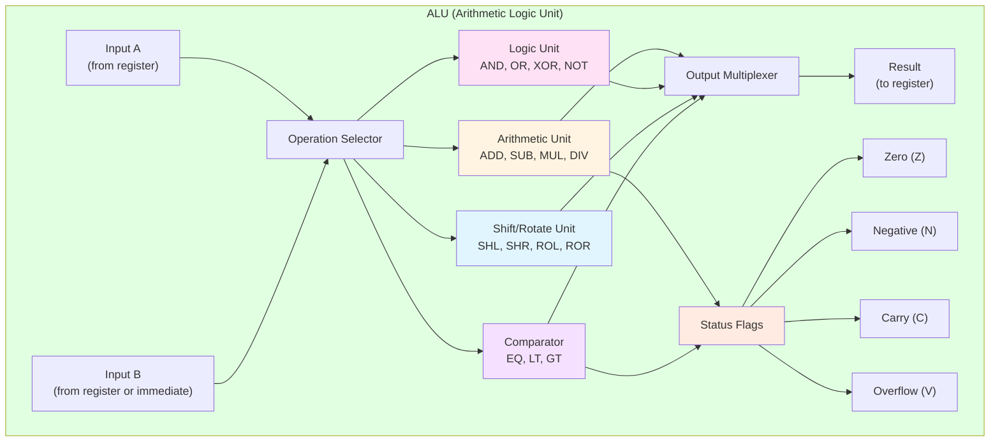

| Operation Type | Examples | Description | Flags Affected |
|---------------|----------|-------------|----------------|
| **Arithmetic** | `ADD`, `SUB`, `MUL`, `DIV` | Basic math operations | `Z`, `N`, `C`, `V` |
| **Logical** | `AND`, `OR`, `XOR`, `NOT` | Bitwise operations | `Z`, `N` |
| **Shift** | `SHL`, `SHR`, `SAR` | Move bits left or right | `Z`, `N`, `C` |
| **Rotate** | `ROL`, `ROR` | Circular bit shifts | `C` |
| **Comparison** | `CMP`, `TEST` | Set flags based on comparison | `Z`, `N`, `C`, `V` |

### 2.3 Program Counter (PC)

The Program Counter:

- contains the address of the next instruction to fetch.
- usually increases by the instruction size after each normal instruction.
- may be changed by:

  - jumps
  - branches
  - function calls and returns
  - exceptions and interrupts (later modules)

If PC is wrong, the CPU will fetch the wrong sequence of instructions, which is why control flow instructions are critical.

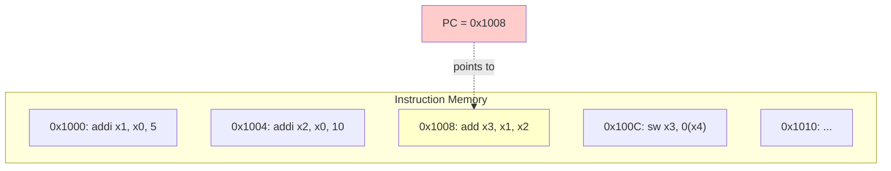

In this RISC-V example:

- Each instruction is `32 bits` (4 bytes), so addresses increment by `4`.
- PC currently holds `0x1008`, pointing to the `add x3, x1, x2` instruction.
- After executing this instruction, `PC` will normally increment to `0x100C`.
- A branch or jump instruction could set `PC` to any valid instruction address.

### 2.4 Control unit

The control unit:

- takes the instruction bits from the Instruction Register (`IR`)
- decodes them into:

  - **ALU** operation
  - which registers to read and write
  - whether to perform memory read or write
  - how to update `PC`
- drives multiplexers and other signals in the datapath

### 2.5 Simplified datapath diagram

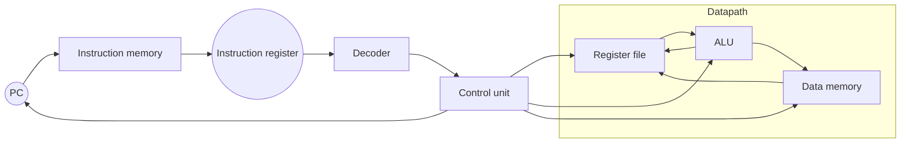

- Data flows through the datapath (register file, ALU, memory).
- Control unit decides what each part does for the current instruction.

---

## 3. Fetch - Decode - Execute Cycle

The CPU is basically a loop that performs three main steps for each instruction.

### 3.1 Fetch

- Use `PC` as an address to instruction memory.
- Read the instruction bits.
- Load them into `IR`.
- Increment `PC` to the next instruction address (for a simple non branching instruction).

### 3.2 Decode

- Split the instruction bits into fields:

  - opcode
  - register indices
  - immediate or offset
- Control unit interprets opcode and decides:

  - which ALU operation to use
  - which registers to read
  - whether to access memory

### 3.3 Execute

Depending on the instruction:

- Arithmetic or logic:

  - read input registers
  - ALU computes
  - write result to destination register
- Load:

  - compute address
  - read from data memory
  - write to register
- Store:

  - compute address
  - read register
  - write to data memory
- Branch or jump:

  - compute condition
  - if true, set `PC` to some target address
  - if false, `PC` remains the sequential next instruction

### 3.4 Loop view

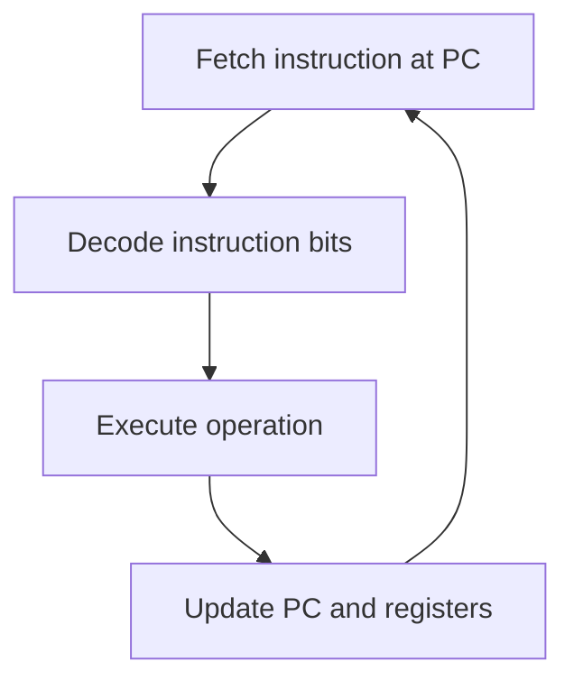

This loop runs continuously. The speed depends on the CPU's clock:

- **Clock cycles**: Each step takes one or more clock cycles (a cycle is one "tick" of the CPU's internal clock).
- **Example**: A 3 GHz CPU does 3 billion cycles per second.

In a simple CPU, one instruction might take 3 to 5 cycles total (1 for fetch, 1 for decode, 1+ for execute).

Modern CPUs use **pipelining**: while one instruction executes, the next one decodes, and another fetches. This overlap means the CPU can finish close to one instruction per cycle, even though each instruction takes multiple cycles to complete.

---

## 4. A Minimal Instruction Sequence Example

Assume a toy ISA with instructions:

- `LOAD Ri, [addr]`
- `ADD Rd, Ra, Rb`
- `STORE Ri, [addr]`
- `HALT`

Initial memory:

- Memory[100] = 7
- Memory[104] = 4

Program:

```text
0: LOAD R1, [100]
1: LOAD R2, [104]
2: ADD  R3, R1, R2
3: STORE R3, [108]
4: HALT
```

Execution:

1. `PC` = `0`, `LOAD R1, [100]` -> `R1` = `7` -> `PC` = `1`
2. `PC` = `1`, `LOAD R2, [104]` -> `R2` = `4` -> `PC` = `2`
3. `PC` = `2`, `ADD R3, R1, R2` -> `R3` = `11` -> `PC` = `3`
4. `PC` = `3`, `STORE R3, [108]` -> Memory[`108`] = `11` -> `PC` = `4`
5. `PC` = `4`, `HALT` -> stop

Final state:

- `R1` = `7`, `R2` = `4`, `R3` = `11`
- Memory[`108`] = `11`

Mermaid execution trace:

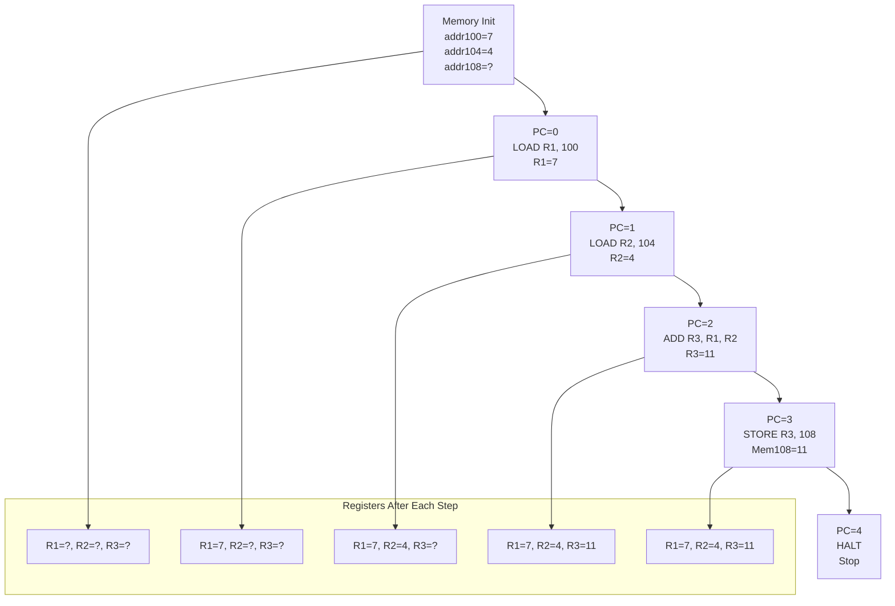

---

## 5. Instruction Set Architecture (ISA)

The **ISA is the software visible interface of the CPU** - it's the contract between hardware and software that defines how programs communicate with the processor.

### 5.1 What the ISA defines

- **Instructions**:
  - which CPU instructions exist:
    - arithmetic, logic
    - loads and stores
    - branches and jumps
    - system calls, special instructions
  - instruction formats:
    - how bits in an instruction are structured
- **Registers**:
  - Fast storage locations programs can access
  - which registers exist and how many (`R0`..`R31`, `x0`..`x31`, `EAX`..`R15`, etc.)
- **Memory model**:
  - addressing modes: how instructions refer to memory
    - immediate
    - register
    - register + offset
- **Data types**: Supported sizes
  - 8 bit, 16 bit, 32 bit, 64 bit integers
  - sometimes floating point formats

Software compiled for a specific ISA runs on any CPU that correctly implements that ISA.

### 5.2 ISA vs microarchitecture

Important separation:

- ISA:

  - what the CPU must be able to do
  - visible to compilers, OS, programs
- Microarchitecture:

  - how the CPU is built internally
  - pipelining, caches, branch predictors, out of order execution, etc.

Two CPUs can have:

- same ISA (for example x86-64)
- very different microarchitectures (simple embedded core vs high performance desktop CPU)

For basic reasoning, we treat the CPU as if it just executes instructions one after another according to the ISA.

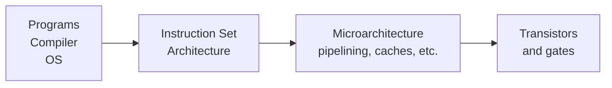

---

## 6. Instruction Formats and Addressing Modes

### 6.1 Simple instruction formats

Example: fixed 32 bit instruction with:

- 6 bits opcode
- 5 bits destination register
- 5 bits source register 1
- 5 bits source register 2
- remaining bits for function or immediate

For a load with an offset:

- opcode
- base register
- destination register
- immediate (offset)

You do not need to memorize exact layouts, but you must understand:

- instructions are just bits
- different fields select operation and operands

### 6.2 Common addressing modes

Basic modes used in most ISAs:

- Immediate:

  - constant value embedded in instruction
  - `ADD R1, R2, 5`

- Register:

  - all operands in registers
  - `ADD R3, R1, R2`

- Base plus offset (register + immediate):

  - memory address is register plus small constant
  - `LOAD R1, 8(R2)`  means address = `R2` + `8`

- Direct:

  - instruction directly contains a memory address
  - common in simple ISAs or examples
  - `LOAD R1, [100]`

---

## 7. Types of Instructions

All real ISAs contain the same main categories.

### 7.1 Arithmetic and logical

Examples:

```text
ADD R1, R2, R3
SUB R4, R5, R6
AND R1, R1, R2
OR  R3, R3, R0
XOR R7, R7, R7  ; set R7 to 0
```

### 7.2 Data movement

```text
LOAD  R1, [addr]
STORE R3, [addr]
MOV   R2, R1
```

### 7.3 Control flow

```text
JMP   label
BEQ   R1, R2, label   ; branch if equal
BNE   R3, R0, label   ; branch if not zero
CALL  function
RET
```

Branches and jumps are what make loops and conditionals possible.

---

## 8. Real ISAs: x86, ARM, and RISC-V

### 8.1 x86 and x86-64

x86 is a CISC ISA family:

- introduced in the 1970s
- extended to 32 bit and then 64 bit (x86-64)
- used in almost all PC and many server CPUs (Intel, AMD, some others)

Characteristics:

- variable length instructions (from 1 byte to 15 bytes)
- rich set of addressing modes
- many legacy instructions for backward compatibility
- a lot of complexity hidden under the ISA

Example snippet:

```asm
mov eax, 5       ; eax = 5
mov ebx, 10      ; ebx = 10
add eax, ebx     ; eax = eax + ebx = 15
```

Under the hood, this is decoded into micro operations executed by a complex microarchitecture, but at ISA level you only see mov and add.

### 8.2 ARM


[ARM1 (1983)](https://arstechnica.com/gadgets/2022/09/a-history-of-arm-part-1-building-the-first-chip/) was a minimalist 32-bit RISC core (≈25K transistors), three-stage pipeline (fetch/decode/execute), no caches, simple register file, and low power design. Sophie Wilson designed the [original ARM instruction set](https://en.wikipedia.org/wiki/ARM_architecture_family#Instruction_set) and early development tools. Steve Furber led the hardware design of the [ARM1 microarchitecture](https://en.wikichip.org/wiki/acorn/microarchitectures/arm1) at Acorn.

Originally ARM stood for Acorn RISC Machine (the first ARM prototypes were built for the [Acorn BBC Micro](https://en.wikipedia.org/wiki/BBC_Micro_expansion_unit)). When the joint venture spun out in 1990, the name changed to Advanced RISC Machines Ltd. Today the company styles its name simply as Arm, and the letters are no longer treated as an acronym.

In modern usage "Arm architecture" refers to the family of 32-bit (Armv7) and 64-bit (Armv8, Armv9) reduced instruction set architectures plus their profiles (A = application, R = real-time, M = microcontroller), licenseable CPU core designs (Cortex, Neoverse), and ecosystem.

ARM is a RISC ISA family:

- dominates smartphones and tablets
- used in many embedded systems and increasingly in servers
- Android phones, Apple M series (Mac/Iphone), many AWS Graviton servers are ARM based

Characteristics:

- mostly fixed instruction size (easier decoding)
- load/store architecture (only load/store can access memory)
- simpler, more regular encoding than x86

Example (ARM like, simplified):

```asm
mov  r0, #5       ; r0 = 5
mov  r1, #10      ; r1 = 10
add  r2, r0, r1   ; r2 = 15
```

### 8.3 RISC-V: open ISA and current status


The original Intel 8086 (1978) had 81 instructions, the original Acorn ARM1 (1983) had 45 instructions, but things have escalated over the years.

[RISC-V](https://en.wikipedia.org/wiki/RISC-V) (University of California, Berkeley, 2010) is a modern RISC ISA with an important twist: the ISA is an open standard.

- Anyone can implement the ISA without paying license fees.
- Extensions are modular (integer, multiplication, atomic operations, vector, etc.).
- Strong focus on embedded, IoT, and custom accelerators, but now also moving into AI and higher performance systems.

Market situation now:

- Analyst forecasts expect RISC-V based processor shipments to grow roughly 50 percent per year between 2024 and 2030, reaching tens of billions of cores by 2030.
- RISC-V already has serious share in microcontrollers and embedded devices, especially in Asia. Some reports put RISC-V enabled silicon close to a quarter of new designs in certain MCU segments.
- China pushes RISC-V to reduce dependence on proprietary Western ISAs.
- [Nvidia](https://riscv.org/blog/how-nvidia-shipped-one-billion-risc-v-cores-in-2024/) has announced CUDA support for RISC-V hosts, so a RISC-V CPU can coordinate GPU workloads in AI systems.
- Consumer devices exist, such as low cost RISC-V laptops or tablets running Linux, plus many dev boards.

High level conclusion:

- x86: still dominant in PCs and classical servers.
- ARM: dominant in phones, strong in cloud and embedded, slowly moving into laptops.
- RISC-V: small but exploding in embedded, IoT, microcontrollers and specialized accelerators. A serious third ISA, especially outside classic desktop.

### 8.4 RISC-V example

Simplified RISC-V style instructions:

```asm
addi x1, x0, 5      # x1 = 5
addi x2, x0, 10     # x2 = 10
add  x3, x1, x2     # x3 = x1 + x2 = 15
```

Key points:

- `x0` is hard wired to `0`.
- `addi` uses an immediate value.
- purely register based arithmetic, following load/store philosophy.

### 8.5 RISC vs CISC in context

**RISC** (ARM, RISC-V):

- simple, regular encoding
- mostly fixed length instructions
- load/store to memory
- easier to pipeline and decode

**CISC** (x86):

- variable length instructions, many addressing modes
- can do more work per single instruction, especially with older styles
- microarchitecture translates CISC instructions into RISC like micro operations internally

Modern CPUs blur this distinction, but the design philosophies still help to understand architectures.

---

## 9. Assembly vs Machine Code

### 9.1 Machine code: what memory actually stores

Memory stores instructions as raw bits. Here is a real RISC-V 32-bit example:

```text
00000000001100010000000010110011
```

grouped logically:

| `0000000` | `00011` | `00010` | `000` | `00001` | `0110011` |
|----------|-------|-------|----------|------|----------|
| `funct7` | `rs2` | `rs1` | `funct3` | `rd` | `opcode` |
| normal add | `x3` | `x2` | `add` op | `x1` | R-type arith |

This 32-bit instruction breaks down as:

- `funct7` (bits 25-31): `0000000` = normal `add` (not subtract)
- `rs2` (bits 20-24): `00011` = `x3` (source register 2)
- `rs1` (bits 15-19): `00010` = `x2` (source register 1)
- `funct3` (bits 12-14): `000` = `add` operation
- `rd` (bits 7-11): `00001` = `x1` (destination register)
- `opcode` (bits 0-6): `0110011` = R-type arithmetic

In hexadecimal this is `0x003100B3`.

To the CPU, this means:

```asm
add x1, x2, x3    # x1 = x2 + x3
```

The RISC-V ISA defines exactly how to interpret these 32 bits. All R-type arithmetic instructions (`add`, `sub`, `and`, `or`, `xor`, etc.) follow this same format, with different `funct3` and `funct7` values selecting the specific operation.

### 9.2 Assembly: human readable representation

Assembly language uses mnemonics and names to represent machine instructions:

```asm
ADD R2, R3, R0
```

Assembler:

- translates assembly to machine code
- replaces mnemonics by opcodes
- resolves labels to addresses
- encodes registers and immediates into fields

Disassembler:

- takes machine code
- decodes bits back into assembly notation
- used for debugging, reverse engineering, learning

### 9.3 Example: simple mapping

Toy ISA:

- opcode for `ADD` is `3` (binary 00000011)
- `R1` encoded as `01`, `R2` as `10`, `R3` as `11`

Instruction:

```asm
ADD R3, R1, R2
```

Could map to bits:

- opcode: `00000011`
- rd:     `11`
- rs1:    `01`
- rs2:    `10`

Machine code may then be something like:

```text
00000011 11011000
```

---

## 10. High Level Code to Assembly to Machine

### 10.1 Conceptual pipeline

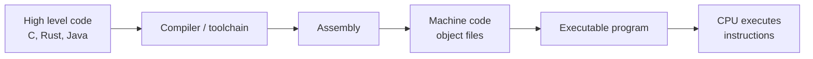

Steps:

1. Programmer writes C, Rust, etc.
2. Compiler translates to assembly (or directly to machine code).
3. Assembler and linker produce an executable.
4. CPU fetches the machine code instructions from memory and runs them.

### 10.2 Example

C code:

```c
int sum(int a, int b) {
    return a + b;
}
```

Possible simplified RISC-V assembly:

```asm
sum:
    add x10, x11, x12   # assume calling convention: x11 = a, x12 = b, x10 = result
    ret
```

Each assembly instruction has a binary encoding defined by the ISA:

- bits for opcode (`add`)
- bits for destination register (`x10`)
- bits for source registers (`x11`, `x12`)
- maybe function bits

Memory only sees those bits, not the C or assembly source.

---

## 11. Turing Completeness and CPUs

### 11.1 Idea of Turing completeness

In 1936, British mathematician Alan Turing described an abstract machine (now called a Turing machine) that could perform any mechanical computation by reading and writing symbols on an infinite tape according to a set of rules. This was a theoretical model, not a physical device, but it became the foundation for understanding what can be computed.

A system is Turing complete if it can simulate a Turing machine, meaning it can compute anything that is computable in principle. This does not mean it is practical or fast, only that:

- given enough memory
- given enough time

it can solve any problem that any other computer can solve.

Most general purpose CPUs are Turing complete because they provide:

- memory to store data and instructions
- arithmetic and logic operations
- conditional branching (decisions)
- loops or recursion (repetition)

These few ingredients are sufficient to build arbitrarily complex programs. Turing completeness is why your phone, laptop, and a mainframe are fundamentally equivalent in computational power - they differ in speed, memory, and I/O, but not in what they can compute.

### 11.2 Why general purpose CPUs are Turing complete

Any realistic ISA has:

- memory read and write
- integer arithmetic and logic
- conditional branches and jumps

This is already enough to simulate a Turing machine or any other computation model.

So:

- x86, ARM, RISC-V, and similar general purpose ISAs are all Turing complete.
- They are equivalent in power; they mainly differ in:

  - performance
  - ecosystem
  - energy efficiency
  - licensing and business model

**Surprisingly Turing complete systems:**

Many systems not designed as general computers turn out to be Turing complete:

- [Microsoft PowerPoint](https://www.microsoft.com/en-us/microsoft-365/powerpoint): Using animations, triggers, and hyperlinks, you can build logic gates and perform arbitrary computation.
- [CSS3 + HTML](https://web.dev/learn/css/): Using Rule 110 patterns or other tricks, styling languages can perform computation.
- [Minecraft](https://www.minecraft.net/en-us): Redstone circuits can implement logic gates, memory, and ALUs, making the game Turing complete.
- [Dwarf Fortress](https://store.steampowered.com/app/975370/Dwarf_Fortress/): The game's water mechanics and pressure plates can build logic circuits.
- [Magic: The Gathering](https://magic.wizards.com/en/intro): The card game's rules allow constructing a Turing machine using specific card combinations.

These examples show that Turing completeness emerges from surprisingly simple rule sets. The key ingredients remain the same: conditional logic, state storage, and the ability to loop or recurse.

### 11.3 Tiny example of Turing complete core pieces

Minimal ingredients:

- Registers and memory
- `LOAD`, `STORE`
- `ADD` or `SUB`
- `JUMP`, `BRANCH if zero` (or similar)

With those, you can build:

- counters
- loops
- conditionals
- data structures

Everything in high level languages (if, while, functions) eventually maps to such primitives.

---

## 12. A More Involved Example Program

Simple loop that sums 10 numbers stored in memory into `R0`.

Assume:

- numbers at Memory[100]..Memory[109]
- N = 10

Toy ISA:

- `LOAD Ri, [addr]`
- `STORE Ri, [addr]`
- `ADD Rd, Ra, Rb`
- `ADDI Rd, Ra, imm`
- `BEQ Ra, Rb, label`
- `JMP label`

Program:

```asm
        ; R0 = sum
        ; R1 = index i
        ; R2 = base address (100)
        ; R3 = temporary for load
        ; R4 = constant N = 10

        LOAD  R0, [0]        ; assume memory[0] = 0, start sum = 0
        LOAD  R2, [1]        ; assume memory[1] = 100, base address
        LOAD  R4, [2]        ; assume memory[2] = 10, N
        LOAD  R1, [0]        ; index i = 0

loop:
        ADD   R5, R2, R1     ; R5 = base + i
        LOAD  R3, [R5]       ; R3 = memory[base + i]
        ADD   R0, R0, R3     ; sum += value
        ADDI  R1, R1, 1      ; i++

        BEQ   R1, R4, done   ; if i == N, exit
        JMP   loop

done:
        STORE R0, [3]        ; store result to memory[3]
        HALT
```

You can trace:

- PC values
- register values (`R0`..`R5`)
- memory reads and writes

This gives a concrete view of:

- how loops and arrays work at instruction level
- how PC and branches control execution

---
